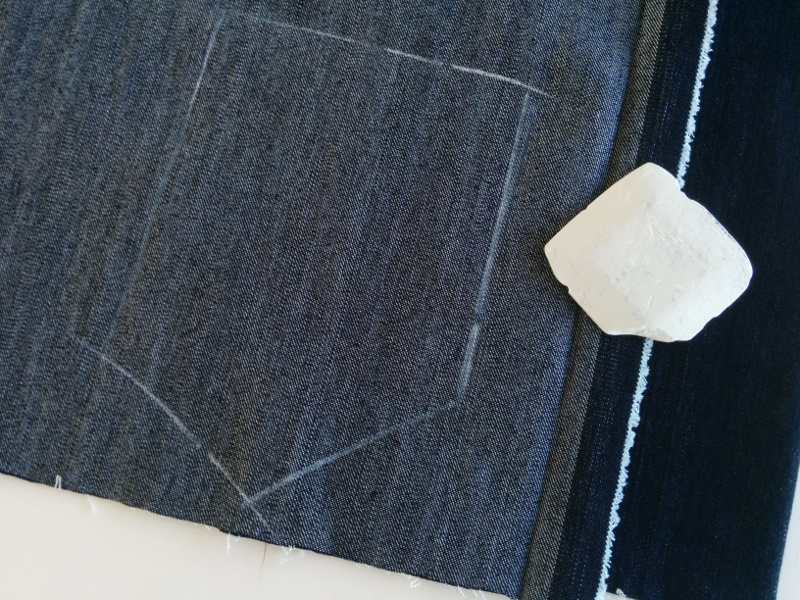

Wenn ich von guten Seiten spreche, dann kann man sich entweder auf Schnitt oder Nähen beziehen:

## Schneiden mit guten Seiten zusammen

Das Schneiden mit guten Seiten ist eine Technik, die benutzt wird, wenn zwei identische oder gespiegelte Teile geschnitten werden müssen.

Wenn ein Muster fordert, ein Stück mit guten Seiten zusammenzuschneiden falten Sie Ihren Stoff doppelt mit der guten Seite/rechte Seite des Stoffes nach innen, und die schlechte Seite/falsche Seite draußen.

Markieren Sie nun das Musterstück auf der schlechten Seite des Stoffes und schneiden Sie beide Schichten in einem Schritt.

Dies gibt Ihnen zwei Teile, die Spiegelbilder voneinander sind.

<Note> 

##### Was passiert, wenn es keine offensichtliche gute Seite gibt?

Wenn du etwas ohne eine offensichtliche _gute_ Seite ausschneidest (wie z.B. Vliesstoff),
ist es wichtig, dass du zwei spiegelverkehrte Stücke ausschneidest und nicht zwei identische.

</Note>

## Nähen mit guten Seiten zusammen

Nähen mit guten Seiten zusammen ist der übliche Ansatz zur Herstellung einer Naht.

Durch das Zusammenlegen der guten Seiten des Stoffes werden beide Teile mit der Nahtzuordnung an die Innenseite des Stoffes verbunden. Das ist für die überwiegende Mehrheit der Nähte getan.

> Wenn es keine speziellen Anweisungen gibt, wie man eine Naht konstruieren kann, dann ist es eine gute Seite zusammen.
