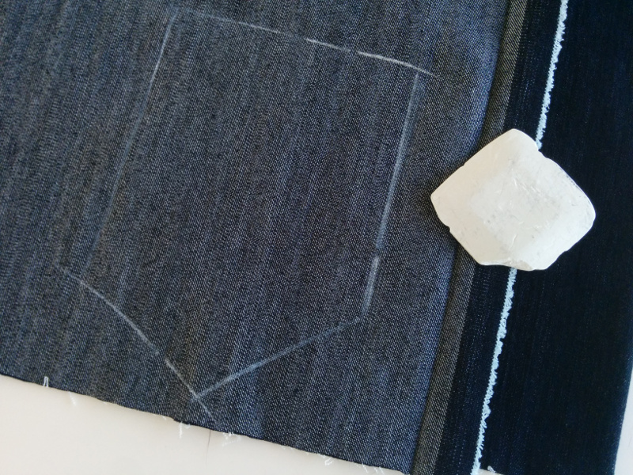
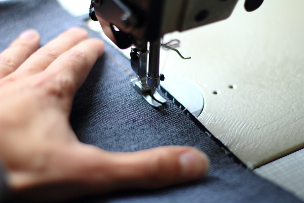

Lorsque je parle 'endroit contre endroit, je veux parler de coupe ou de couture :

## Couper endroit contre endroit

Couper endroit contre endroit est une technique qui est utilisée lorsque deux pièces identiques ou en miroir doivent être coupées.

Quand un patron demande de couper une pièce endroit contre endroit, pliez votre tissu en deux avec le bon côté du tissu (l'endroit) à l'intérieur, et l'envers à l'extérieur.

Tracez maintenant le patron sur l'envers du tissu, et coupez les deux épaisseurs en une seule fois.

Cela vous donne deux pièces en miroir les unes des autres.

<Note> 

##### Que se passe-t-il s'il n'y a pas de bon côté évident ?

Lorsque vous coupez quelque chose sans un côté *bon* évident (comme l'interface), 
ce qui importe, c'est que vous coupez deux pièces miroir plutôt que deux pièces identiques.

</Note>

## Coudre endroit contre endroit

Coudre endroit contre endroit est la façon commune de coudre.

En plaçant les tissus endroit contre endroit, les deux pièces seront assemblées avec la marge de couture à l'intérieur du vêtement. C'est ce qui est fait pour la grande majorité des coutures.

> Quand il n'y a pas d'instructions spécifiques sur la façon de construire une couture, c'est de bons côtés ensemble.
