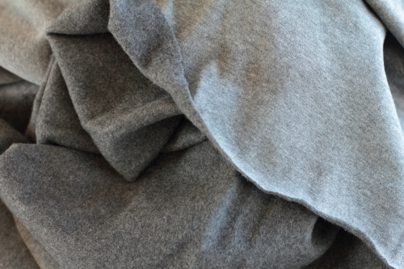

Jersey ist eine Art Strickstoff. Jersey hat eine flache und eine geraffte Seite, und wird oft für T-Shirts verwendet.

Jersey kann auch doppelt gestrickt sein (manchmal auch Interlock-Jersey genannt). Dadurch entsteht ein dickeres Gewebe mit den flachen Seiten an der Außenseite und den gerafften in der Mitte verriegelt.

Jersey lässt sich gut drapieren, wodurch es beliebt für Oberteile und Kleider ist.
