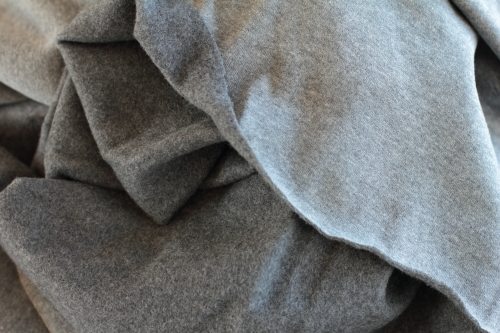

Jersey is a type of knit fabric. Jersey has a flat and a piled side, and is often used for T-shirts.

Jersey can also be double-knitted (sometimes called interlock jersey). This produces a thicker fabric with the flat sides on the outside and the piled sides locked in the middle.

Jersey has good drape which makes it a popular choice for tops and dresses.
