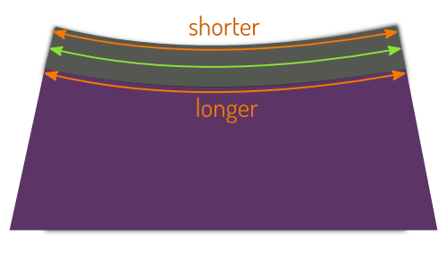

## Was ist sowieso Strickbindung?

Knit binden ist ein allgemeiner Begriff für eine Art von Oberfläche (typischerweise) am Hals oder Arm Öffnung von T-Shirts und anderen Strickwaren.

Es gibt zwei Varianten dieser Oberfläche, ein Strickband und tatsächlich Strickverbindung.

## Strickband

Knit Band ist das, was Sie normalerweise an der Halsöffnung Ihres T-Shirts finden. Es ist ein Stoffstreifen, der doppelt gefaltet und am Rand des Kleidungsstückes befestigt ist.

Dies hinterlässt einen unvollendeten Rand an der Innenseite, der oft mit Kantenstich um das Strickband genäht wird.

### Strickbindung

Echte Strickbindungen wirken eher wie klassische Bindungen, da sie um den Stoff gewickelt sind als sich von ihm zu erstrecken.

Die rohe Kante des Kleidungsstückes wird zwischen der gefalteten Strickbindung, die nach unten gestickt ist, eingelegt. Oft erfolgt dies mit einer Coverlock Maschine, wodurch das Innere ordentlich vervollständigt wird.

> Pictures by [Support Tattoos and Piercings at Work](https://www.flickr.com/photos/supporttattoosandpiercingsatwork/21870942614/) and [Derek A.](https://www.flickr.com/photos/sfj/696122404/)

### Stil vs Funktion

Ein Strickband ist häufiger und ist das, was man normalerweise an T-Shirt-Halslinien findet. Es ist die eher dekorative Option.

Eine Strickbindung ist weniger üblich, wird aber oft auf Unterhemden verwendet (wie in Unterwäsche). Es ist die funktionalere Option.

> ##### Noch verwirrt?
> 
> Eine weitere Möglichkeit, sie zu unterscheiden, ist Folgendes: Denken Sie daran, was passiert, wenn Sie die Strickbindung/Band erweitern.
> 
> Auf einem T-Shirt wird die Erweiterung der Band am Hals die Öffnung des Hals verkleinern. Wenn Sie eine breitere Band wollen, müssen Sie ein größeres Loch in Ihr T-Shirt schneiden.
> 
> Wenn du bei einem Unterhemd möchtest, dass das Strickbündchen am Hals breiter ist, macht es die Halsöffnung nicht kleiner. Stattdessen wird die Bindung einfach weiter über das Unterhemdengewebe gelegt.

## Warum Strickbekleidungsbindung Dehnungen erfordert

Egal ob Strickband oder Strickverbindungsoberfläche, Sie müssen Ihr Bindegewebe ausdehnen, um gute Ergebnisse zu erzielen. Das heißt, wenn Sie nicht eine geradlinige Naht nähen. Hier ist warum:

### Straight: Leben im einfachen Modus

Auf einer geraden Naht können Sie einfach Ihre Bindung/Band anbringen. Ihr Stoff und Ihre Bindung haben die gleiche Länge, also wird alles in Ordnung sein.

Das wahrscheinlichste Szenario, in dem Sie dies begegnen werden, ist die (kurz) Ärmel eines T-Shirts. Obwohl das Strickband um deinen Arm umwickelt, aus einer Musterperspektive (wie in, wenn der Stoff noch flach ist) ist es eine geradlinige Naht.

### Einheitlich gekrümmt: einheitliches Strecken

Auf einer geschwungenen Naht, wie eine Halsöffnung, wird die Sache etwas komplizierter. Das liegt daran, dass der äußere Rand und der innere Rand des Bindemittels eine andere Länge haben.

**Keine Streckung und die Dinge werden nicht flach liegen (aka gape)**

Wenn Sie einfach die Bindung an den Stoff nähen, werden die Dinge am äußeren Rand Ihrer Bindung gut sein. Aber die Innenkante ist kürzer und Ihr Bindegewebe wird zusammengedrückt. Die dadurch entstehende Spannung steigt, und Ihre Bindung wird nicht flach gegen Ihre Haut liegen.

**Strecke es genau richtig, und es wird großartig aussehen**

Um dieses Problem zu beheben, müssen Sie Ihre Strickbindung (und nicht das Stoff) strecken, während Sie Ihre Bindung anhängen. Wenn Sie es richtig machen, wird die äußere Kante ein wenig geöffnet Während die Innenkante Ihre Kurve schön ausfüllt und alles wird flach liegen.

**Wenn du zu viel streckst, werden die Dinge falten**

Strecken Sie Ihre Bindung zu viel und sie wird zu weit zurückweichen, was das Hauptgewebe zum Falten macht.

### Reales Leben: variable Streckung

Es gibt gerade Nähte, und obwohl ich nie auf eine gestochen bin, gibt es vielleicht auch gleichmäßig gebogene Nähte. Aber in den meisten Fällen wird die Krümmung der Naht variieren.

Auf einer typischen T-Shirt-Halslinie unterscheidet sich die Kurve am Hals von der Vorderseite, und es gibt wahrscheinlich eine etwas engere Biegung hinter Ihrer Schulternaht.

Bei einer leichten Kurve ist der Unterschied zwischen Innen- und Außenkante nicht so groß, und ein bisschen Stretch ist alles, was Sie brauchen. Aber bei einer engeren Kurve wird der Unterschied zwischen Innen- und Außenkante der Bindung noch deutlicher. Und Sie brauchen mehr Strecke, um dafür zu unterkommen.

So wie du deiner Naht folgst und es kursiert um Halslinien, oder Schultern, oder Designfunktionen, müssen Sie die Menge der Stretch an die Situation anpassen.

## Sie können die Länge Ihrer Strickbindung nicht berechnen

Ich sage nicht, dass dies theoretisch unmöglich ist. Aber ich sage, das ist praktisch unmöglich.

Die Länge Ihres Strickbindes hängt davon ab, wie viel Sie strecken müssen. Dies hängt von den Kurven ab, denen Sie folgen müssen, und von der Breite der Bindung, ganz zu schweigen von der Stärke ihrer Dehnung. Es gibt einfach zu viele Parameter, die man berücksichtigen kann, um die Länge der Bindung genau zu berechnen.

### Dies nicht tun

Es gibt eine Reihe von Tutorials im Internet, die Ihnen zeigen, wie man auf Strickbinden näht. Viele von ihnen schlagen so etwas wie _vor, dass der Hals 90 % der Länge der Naht bindet, die Sie an_ befestigen (prozentual variiert).

Diese Idee ist, dass Sie Ihre Bindung geschnitten, fügen Sie ihre Kanten zusammen und nähen Sie sie dann in der Öffnung. Das ist (meiner Meinung nach) nicht gut.

Ein alternativer Ansatz, die Längenproblematik zu umgehen, besteht darin, die Bindung vor dem Schließen der Öffnung, in der Ihre Bindung eintritt. Zum Beispiel schließen Sie auf einem T-Shirt eine Schulternaht, befestigen die Bindung, dann schließen Sie die zweite Schulternaht.

Das bedeutet natürlich, dass Ihre Schulternaht durch Ihre Bindung geschnitten wird, was ein großes Nein in meinem Buch ist.

### Stattdessen tun

- Schneiden Sie Ihre Bindung so lange, wie die Naht, in die sie genäht werden muss. Nicht 90 %, sondern 100 %. Auf diese Weise wissen Sie, dass es zu lange dauern wird, und das ist, was wir wollen.
- Markieren Sie den Ort, an dem Sie Ihre Bindung verbinden möchten (sagen Sie die Mitte der Halslinie) und legen Sie Ihre Bindung 1cm über diesen Punkt hinaus.
- Nähen Sie Ihre Bindung ungefähr 3 cm und gehen Sie den ganzen Weg. Dabei sollten Sie die Streckung an die gewünschte Kurve anpassen. Dafür gibt es keine Tricks, du musst üben, bis es zu dir kommt.
- Wenn Sie sich umdrehen und näher an den von Ihnen markierten Punkt kommen, stoppen Sie vorher etwa 3cm lang.
- Jetzt ist Ihr ganzes Bindegewebe befestigt, abgesehen von etwa 6 cm auf der Rückseite. Nähen Sie beide Kanten Ihrer guten Seiten zusammen und machen Sie so lange wie nötig und nähen Sie sie zusammen.
- Nähen Sie die restlichen 6 cm Ihrer Bindung.

Auf diese Weise erraten wir nicht, wie lange Ihre Bindung sein sollte, und die bindenden Naht sitzt dort, wo Sie sie haben wollen.

> Für detaillierte Anweisungen, schaue dir [die Aaron-Dokumentation](/docs/patterns/aaron/)

## Alternate method

While the above instructions describe one way to attach a knit band or knit binding, it is not the only method that can be used. An alternate method is to cut the exact amount of binding needed, sew it into a ring, and then attach the ring to the garment opening.

Some people feel that this is an easier method for novice sewists. They are told exactly how much binding to use, and they do not have to guess how much they should be stretching the binding as they sew.

1. Measure the garment opening that the binding will cover. Be sure to measure at the seamline, to account for seam allowance.

2. Check the pattern instructions for the length of binding to use. Or, use a length 80-90% smaller than the opening based on the stretchiness of the binding fabric. (For example, 80% for very stretchy fabric, 90% for less stretchy fabric.)

3. Cut the length of binding required plus seam allowance at each end.

4. Sew the binding ends right sides together to form a closed loop or ring. Trim excess seam allowance.

5. Fold the ring together at the seam to divide the ring into equal halves. Mark or insert pins at each end fold. One pin will be in the seam, and the other will mark the halfway point around the ring.

6. Unfold the ring and fold it again into equal halves so the two marks/pins meet together in the middle. Again mark or insert pins into each end fold. Now there are 4 pins or marks dividing the ring into 4 quarters of equal length.

7. Similarly, fold the garment opening and mark or insert pins to divide the garment opening into 4 quarters of equal length.

8. Match the marks or pins on the binding with the ones on the garment opening. (Try to align it so the seam is at the most inconspicuous location in the garment opening. For example, if binding a neck opening align the binding so the seam is at the back of the neck opening.)

9. Pin the binding ring to the garment opening at each quarter mark/pin. This ensures that the binding is evenly distributed around the garment opening.

10. Sew the binding to the opening, one quarter at a time. While sewing, evenly stretch each quarter segment of binding to match the length of the quarter segment of garment opening.
