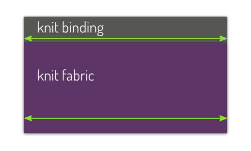
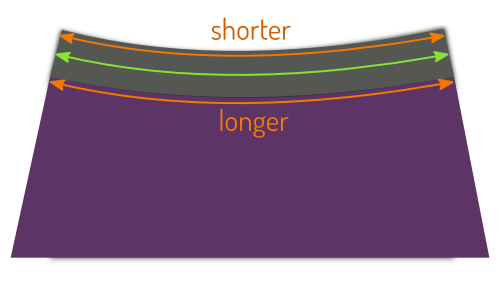
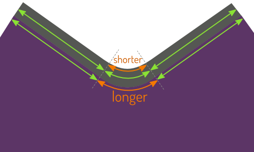

## What is knit binding anyway?

Knit binding is a general term for a type of finish (typically) found on the neck or arm opening of T-shirts and other knitwear.

There are two varieties of this finish, a knit _band_ and actual knit _binding_.

## Knit band

Knit band is what you typically find at the neck opening of your T-shirt. It's a strip of fabric that is folded double and attached to the edge of the garment
such that some of the fabric strip extends beyond the unfinished edge of garment.

This leaves an unfinished edge on the inside that is often sewn down by edge-stitching around the knit band.

### Knit binding

Real knit binding acts more like classic bias binding, in that it wraps around the unfinished edge of the garment, rather than extend from it.

The raw edge of the garment is inserted between the folded knit binding, which is edge-stitched down.
This is often done with a coverlock machine, thereby neatly finishing the inside.

> Pictures by [Support Tattoos and Piercings at Work](https://www.flickr.com/photos/supporttattoosandpiercingsatwork/21870942614/)
> and [Derek A.](https://www.flickr.com/photos/sfj/696122404/)

### Style vs function

A knit band is more common and is what you typically find on T-shirt necklines. It's the more decorative option.

A knit binding is less common but often used on undershirts (as in, underwear). It's the more functional option.

> ##### Still confused?
>
> Another way to distinguish them is this: Think about what happens when you decide to widen the knit binding/band.
>
> On a T-shirt, widening the band at the neck will make the neck opening smaller.
> If you want a wider band with the same finished neck opening size, you will have to cut a larger neck hole in your T-shirt.
>
> On an undershirt, if you want the knitwear binding at the neck to be wider,
> it will not make the neck opening smaller.
> Instead, the binding will simply lay further over the undershirt main fabric.

## Why knitwear binding requires stretch

Whether you're using a knit band or a knit binding finish, you are going to have to stretch your binding fabric for good results. That is, assuming you're not sewing a straight seam. Here's why:

<Note>

The remainder of this documentation uses the term _binding_ to refer to both knit bands and knit binding.

</Note>

### Straight: life on easy mode

On a straight seam, you can simply attach your binding. Your fabric and binding have the same length, so everything will be fine.

The most likely scenario where you will encounter this is on the (short) sleeves of a T-shirt. Although the knit band wraps around your arm, from a pattern perspective (as in, when the fabric is still flat) it's a straight seam.

### Uniformly curved: uniform stretch

On a curved seam, like an neck opening, things get a little more complicated. That is because the outer edge and the inner edge of your binding will have a different length.

**No stretch, and things won't lie flat (aka gape)**

If you simply sew the binding to the fabric, things will be fine at the outer edge of your binding. But the inner edge is shorter, and your binding fabric will be pushed together. The tension that this creates will make it rise, and your binding will not lie flat against your skin.

**Stretch it just right, and it will look great**

To fix this issue, you need to stretch your knit binding (and not the fabric) while attaching your binding. If you do it right, the outer edge will be stretched open a bit, while the inner edge will nicely fill out your curve and everything will lie flat.

**If you stretch too much, things will wrinkle**

Stretch your binding too much, and it will spring back too far, causing the main fabric to wrinkle.

### Real life: variable stretch

Straight seams exist, and perhaps uniformly curved seams exist too. But more often than not, the curvature of your seam will vary.

On a typical T-shirt neckline, the curve at the back of your neck is different from the front, and there's probably a somewhat tighter bend behind your shoulder seam.

On a slight curve, the difference between the inner and outer edge is not so big, and a little bit of stretch is all you need. But on a tighter curve, the difference between the inner and outer edge of your binding will be more significant. And, you'll need more stretch to accommodate for that.

So as you follow your seam and as it curves around necklines, shoulders, or design features, you will have to adapt the amount of stretch to the situation.

## Methods for attaching binding

There are differing opinions about the method that should be used to
attach binding. The two main methods are:

1. Calculating the length of binding to use, sewing the binding into a
closed ring, and sewing the ring of binding to the garment.
2. Attaching binding to the garment while stretching the binding, using
just enough, and cutting off the excess.

### Method 1: Ring method

1. Measure the opening seam that the binding will cover.
2. Check the pattern instructions for guidance on the length of binding to use.
Or, use a length 70-85% smaller than the opening based on the stretchiness
of the binding fabric (For example, 70% for fabrics with a stretch of 40% or greater,
85% for those with a stretch of 10% or less).
3. Cut the length of binding required, plus seam allowance at each end.
4. Sew the binding together to form a closed loop or ring.
5. Mark or insert pins into the ring in 4 places, starting at the seam
to divide the ring into 4 quarters of equal length.
6. Mark or insert pins into the garment opening in 4 places,
dividing the opening into 4 quarters of equal length.
7. Match the marks or pins on the ring with the ones on the garment opening, and pin the binding ring to the opening in 4 places, at each quarter
mark/pin.
8. While evenly stretching each quarter segment of the binding ring into
its quarter segment of garment opening, sew the binding to the opening.

Pros: Some people feel this is the easiest method for novice sewists
because they are told exactly how much binding to use.
This method also requires less technical skill during the construction
process.

Cons: Some people say that it is not possible or practical to accurately
calculate the length of binding needed because there are too many factors.
The binding length and amount it needs to be stretched depends on the
cuves that need to be followed and the material, width, and stretchiness of the binding.
This method applies the binding evenly into the opening, without taking into consideration the actual curves of the opening, and this may lead to a
suboptimal distribution of binding in the opening.

### Method 2: Stretching method

1. Cut your binding exactly as long as the seam it needs to be sewn into. Not 90%, but 100%. This way, you know it's going to be too long, and that's what we want.
2. Mark the place you want your binding to be joined (say center back of the neckline) and place your binding 1 cm beyond this point.
3. Start sewing your binding about 3 cm or so from this point, and go all the way around. While you do so, make sure to adjust the stretch to whatever the curve requires. There are no tricks for this; you'll have to practice until it comes naturally to you.
4. When you make your way around and get close to the point you marked, stop about 3 cm before that. Now your entire binding is attached, apart from a 6 cm or so stretch at the back.
5. Pin both edges of your binding good sides together to form the binding into a closed loop, making it exactly as long as needed.
6. Cut off the excess binding, and sew the binding loop closed.
7. Sew this remaining 6 cm or so binding loop to the garment.

<Tip>
While it is impossible to know the exact length of binding you will end
up using, lengths of 70-85% of the garment opening are common.
</Tip>

Pros: Some people feel that this is the best method to use because it always
results in the exact length of binding needed being used.
No calculations or measurements are required, and it works regardless
of the binding material fabric, width, or stretchiness.

Cons: Some people find this method difficult for novice sewists because
knowledge of the correct amount of stretch to apply to the binding is
something that is gained only with experience.
It may also be difficult to apply and maintain a consistent stretch
while sewing the binding.

> For detailed instructions, check [the Aaron documentation](/docs/patterns/aaron/)
