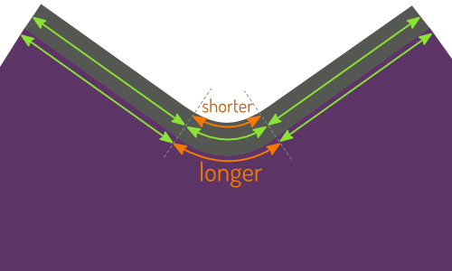

## ¿Qué es la vinculación de tejidos de todos modos?

La unión de tejidos es un término general para un tipo de acabado (típicamente) que se encuentra en el cuello o en la apertura del brazo de camisetas y otros tejidos.

Hay dos variantes de este acabado, una banda de tejidos, y la unión de tejidos.

## Banda Knit

La banda de Knit es lo que usted suele encontrar en la abertura del cuello de su camiseta. Es una tira de tela doblada y acoplada al borde de la prenda.

Esto deja una arista inacabada en el interior que a menudo es cosido por el borde de la banda de tejido.

### Vinculación de nudo

La unión real de tejidos actúa más como la clásica unión de sesiones, en la medida en que se envuelve alrededor de la tela, en lugar de extenderse desde ella.

El borde crudo de la prenda se inserta entre la unión plegada de tejidos, que se emite hacia abajo. Esto se hace a menudo con una máquina de cierre, con lo que el acabado del interior es muy sencillo.

> Pictures by [Support Tattoos and Piercings at Work](https://www.flickr.com/photos/supporttattoosandpiercingsatwork/21870942614/) and [Derek A.](https://www.flickr.com/photos/sfj/696122404/)

### Estilo vs función
Una banda de knit es más común, y es lo que normalmente se encuentra en las líneas de cuello de la camiseta. Es la opción más decorativa.

Una unión de tejidos es menos común, pero a menudo se usa en las camisetas inferiores (como en la ropa interior). Es la opción más funcional.

> ##### ¿Aún está confundido?
> 
> Otra forma de distinguirlos es la siguiente: Piensa en lo que sucede cuando decidas ampliar la unión y la banda.
> 
> En una camiseta, la ampliación de la banda en el cuello hará que la apertura del cuello sea más pequeña. Si desea una banda más ancha, tendrá que cortar un agujero más grande en su camiseta.
> 
> On an undershirt, if you want the knitwear binding at the neck to be wider, it will not make the neck opening smaller. En lugar de ello, la unión simplemente se extenderá más sobre la tela principal de la camiseta.

## ¿Por qué la vinculación del tejido requiere estiramiento?

Ya sea que esté usando una banda de tejidos o un acabado de unión de tejidos, tendrá que estirar su tejido para obtener buenos resultados. Es decir, suponiendo que no estés cosiendo una costura recta. Por qué:

### Straight: vida en modo fácil

En una costura recta, puede simplemente adjuntar su enlace/banda. Tu tela y tu unión tienen la misma longitud, por lo que todo estará bien.

El escenario más probable en el que encontrará esto es en las mangas (cortas) de una camiseta. Aunque la banda de tejidos se envuelve alrededor de su brazo, desde una perspectiva de patrón (como en el caso de que la tela siga siendo plana) es una costura recta.

### Curvado uniformemente: estiramiento uniforme

En una costura curvada, como una abertura de cuello, las cosas se complican un poco. Esto se debe a que el borde exterior y el borde interior de su unión tendrán una longitud diferente.

**No hay estiramiento, y las cosas no se quedarán planas (también conocido como gape)**

Si usted simplemente coser la unión a la tela, las cosas estarán bien en el borde exterior de su enlace. Pero el borde interior es más corto, y tu tejido ligado se empujará juntos. La tensión que esto crea hará que aumente y su unión no estará plana contra su piel.

**Escribirlo bien, y se verá muy bien**

Para solucionar este problema, necesita estirar su unión de tejidos (y no el tejido) mientras adjunta su vinculación. Si lo haces bien, el borde exterior se estirará un poco, mientras que el borde interior llenará muy bien su curva y todo estará plano.

**Si se estira demasiado, las cosas se encenderán**

Estira tu unión demasiado, y volverá demasiado lejos, haciendo que la tela principal se enrolle.

### Vida real: estiramiento de variables)

Las costuras estrechas existen, y aunque nunca he encontrado una, tal vez también existan costuras unitariamente curvadas. Pero la mayoría de las veces la curvatura de tu costura variará.

En un cuello típico de camiseta, la curva en la parte trasera del cuello es diferente del frontal, y es probable que haya una inclinación algo detrás de tu costura de hombro.

En una curva ligera, la diferencia entre el borde interior y exterior no es tan grande, y un poco de ruido es todo lo que necesitas. Pero en una curva apretada, la diferencia entre el borde interior y exterior de la unión será más significativa. Y para ello necesitarás más estilo.

Así que a medida que sigues tu costura, y se curva alrededor del cuello, o hombros, o características de diseño, tendrás que adaptar la cantidad de estiramiento a la situación.

## No se puede calcular la longitud de la unión de nudos
No digo que sea teóricamente imposible. Pero digo que es prácticamente imposible.

La longitud de la unión depende de la cantidad que necesita para ser estirada. Esto depende de las curvas que tienes que seguir, y de la anchura del encuadre, por no hablar de la fuerza de su estiramiento. Hay demasiados parámetros para tener en cuenta para calcular con precisión su longitud de enlace.

### No hacer esto
Hay un montón de tutoriales en Internet que te muestran cómo coser en la unión de tejidos. Muchas de estas sugieren algo como _hace que el cuello se vincule el 90% de la longitud de la costura que estás adjuntando a_ (el porcentaje varia).

Esta idea es que cortes tu vinculación, unes sus bordes, y luego coser en la apertura. Eso no es bueno (en mi opinión).

Un enfoque alternativo para evitar la cuestión de la longitud es fijar la vinculación antes de cerrar la apertura de la unión entra. Por ejemplo, en una camisa se cierra una costura de hombro, se coloca el encuadernador, luego se cierra la segunda costura de hombro.

Obviamente, eso significa que su costura en el hombro cortarán su cuerpo, que es un no grande en mi libro.

### En su lugar, hacer esto

 - Cortar la unión siempre y cuando la costura necesite ser cocida. No el 90%, sino el 100%. De esta manera, sabes que va a ser demasiado largo, y eso es lo que queremos.
 - Marque el lugar que desea que su unión se una (digamos centro de la línea del cuello) y coloque su enlace a 1 cm más allá de este punto.
 - Comience a coser su unión alrededor de 3 cm a partir de este punto y vaya hasta el final. Mientras lo haces, asegúrate de ajustar el estiramiento a lo que la curva requiera. No hay trucos para esto, tendrás que practicar hasta que te venga de forma natural.
 - Cuando usted se acerque y se acerque al punto marcado, se detenga alrededor de 3cm antes de eso.
 - Ahora toda su unión está adjunta, aparte de unos 6 cm de anchura en la parte trasera. Anclar ambos bordes de tus lados buenos de unión juntos, hacer es exactamente el tiempo que se necesita y coser juntos.
 - Difunde los 6 cm restantes de su encuadernación.

De esta manera, no hay que adivinar cuánto tiempo debe ser su vinculación, y la costura de unión se sienta donde desea que se sienta.

> Para instrucciones detalladas, consulte [la documentación de Aaron](/docs/patterns/aaron/)
