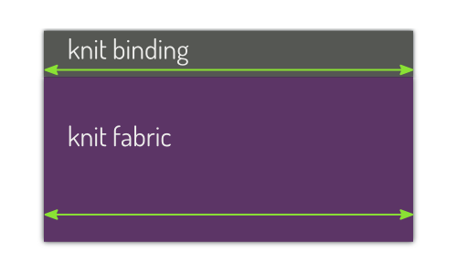

## Що таке трикотажна в'язка?

Трикотажна в'язка - це загальний термін для позначення типу оздоблення (зазвичай), що зустрічається на горловині або на рукавах футболок та інших трикотажних виробів.

Існує два різновиди такого оздоблення: трикотажна стрічка та власне трикотажна палітурка.

## Трикотажна стрічка

Трикотажна стрічка - це те, що ви зазвичай знаходите біля горловини футболки. Це смужка тканини, складена вдвічі і прикріплена до краю одягу.

Це залишає незакінчений край на внутрішній стороні, який часто зашивають краєобметочним швом навколо трикотажної стрічки.

### Трикотажна палітурка

Справжня трикотажна в'язка більше схожа на класичну зміщену в'язку, оскільки вона обертається навколо тканини, а не виходить з неї.

Необроблений край виробу вставляється між складеними трикотажними палітурками, які прострочуються по краю. Часто це робиться за допомогою коверлок-машини, таким чином акуратно обробляючи внутрішню сторону.

> Pictures by [Support Tattoos and Piercings at Work](https://www.flickr.com/photos/supporttattoosandpiercingsatwork/21870942614/) and [Derek A.](https://www.flickr.com/photos/sfj/696122404/)

### Стиль vs функція

Трикотажна стрічка є більш поширеною, і саме її ви зазвичай зустрічаєте на вирізах футболок. Це більш декоративний варіант.

Трикотажна в'язка менш поширена, але часто використовується на майках (наприклад, нижній білизні). Це більш функціональний варіант.

> ##### Все ще розгублений?
> 
> Ще один спосіб розрізнити їх - ось як: Подумайте, що станеться, коли ви вирішите розширити в'язальну в'язку/бандери.
> 
> На футболці, розширивши смужку біля горловини, ви зменшите отвір для горловини. Якщо вам потрібна ширша стрічка, вам доведеться вирізати більший отвір у футболці.
> 
> На майці, якщо ви хочете, щоб трикотажна в'язка біля горловини була ширшою, це не зробить отвір горловини меншим. Натомість палітурка просто ляже далі на основну тканину майки.

## Чому в'язка трикотажу потребує розтягування

Незалежно від того, чи використовуєте ви трикотажну стрічку або трикотажну палітурку, вам доведеться розтягнути палітурну тканину для отримання гарних результатів. Тобто, якщо припустити, що ви не шиєте прямим швом. Ось чому:

### Натурал: життя в легкому режимі

На прямий шов можна просто прикріпити палітурку/бант. Ваша тканина і палітурка мають однакову довжину, тому все буде добре.

Найімовірніший сценарій, коли ви зіткнетеся з цим - на (коротких) рукавах футболки. Хоча трикотажна стрічка обертається навколо руки, з точки зору викрійки (коли тканина залишається плоскою) це прямий шов.

### Рівномірно вигнутий: рівномірне розтягнення

З вигнутим швом, наприклад, горловиною, все трохи складніше. Це тому, що зовнішній і внутрішній краї палітурки матимуть різну довжину.

**Не розтягується, і речі не будуть лежати рівно (так званий "зяючий")**

Якщо ви просто пришиваєте палітурку до тканини, все буде добре на зовнішньому краю палітурки. Але внутрішній край коротший, і ваша палітурна тканина буде притиснута одна до одної. Натяг, який при цьому створюється, змусить її підніматися, і ваша палітурка не буде щільно прилягати до шкіри.

**Розтягніть його як слід, і він буде виглядати чудово**

Щоб виправити цю проблему, потрібно розтягнути трикотажну в'язку (а не тканину) під час пришивання палітурки. Якщо ви все зробите правильно, зовнішній край буде трохи розтягнутий, а внутрішній красиво заповнить ваш вигин, і все буде лежати рівно.

**Якщо розтягнути занадто сильно, речі помнуться**

Занадто сильно розтягніть палітурку, і вона занадто сильно пружинитиме, що призведе до зморщування основної тканини.

### Реальне життя: змінна розтяжка

Існують прямі шви, і хоча я ніколи не стикався з такими, можливо, рівномірно вигнуті шви теж існують. Але найчастіше кривизна вашого шва буде різною.

На типовому вирізі футболки вигин ззаду шиї відрізняється від переднього, а за плечовим швом, ймовірно, є дещо вужчий вигин.

На невеликому вигині різниця між внутрішнім і зовнішнім краєм не така вже й велика, і все, що вам потрібно - це трохи розтягнути. Але на більш вузькому вигині різниця між внутрішнім і зовнішнім краєм палітурки буде більш значною. І вам знадобиться більше розтяжки, щоб пристосуватися до цього.

Тому, коли ви будете стежити за швом, а він вигинається навколо вирізу горловини, плечей або особливостей дизайну, вам доведеться адаптувати величину розтяжки до ситуації.

## Ви не можете розрахувати довжину трикотажної в'язки

Я не кажу, що це теоретично неможливо. Але я кажу, що це практично неможливо.

Довжина вашої в'язальної палітурки залежить від того, наскільки її потрібно розтягнути. Це залежить від вигинів, яких вам доведеться дотримуватися, і ширини палітурки, не кажучи вже про силу її розтяжності. Для точного розрахунку довжини палітурки потрібно врахувати надто багато параметрів.

### Не робіть цього

В інтернеті є безліч уроків, які показують, як пришивати трикотажні палітурки. Багато з них пропонують щось на кшталт _зробити горловину зав'язкою на 90% довжини шва, до якого ви її прикріплюєте_ (відсоток варіюється).

Ідея полягає в тому, що ви розрізаєте палітурку, з'єднуєте її краї, а потім прошиваєте в отвір. Це (на мою думку) недобре.

Альтернативний підхід до вирішення проблеми довжини полягає в тому, щоб прикріпити палітурку до того, як ви закриєте отвір, в який входить палітурка. Наприклад, на футболці ви закриваєте один плечовий шов, прикріплюєте палітурку, потім закриваєте другий плечовий шов.

Очевидно, що це означає, що ваш плечовий шов буде прорізати палітурку, що є великим "ні" в моїй книзі.

### Замість цього зробіть так

- Відріжте палітурку на довжину шва, в який вона має бути вшита. Не 90%, а 100%. Таким чином, ви знаєте, що це буде занадто довго, і це те, чого ми хочемо.
- Позначте місце, де ви хочете з'єднати палітурку (скажімо, центр задньої частини вирізу горловини), і розмістіть палітурку на 1 см далі від цієї точки.
- Почніть прошивати палітурку приблизно через 3 см від цієї точки і пройдіть по всьому периметру. Під час цього не забудьте відрегулювати розтягнення відповідно до того, як цього вимагає крива. Тут немає ніяких хитрощів, вам доведеться потренуватися, поки це не стане для вас природним.
- Коли ви зробите обхід і наблизитесь до позначеної точки, зупиніться приблизно за 3 см до неї.
- Тепер вся палітурка прикріплена, за винятком 6-сантиметрової розтяжки ззаду. Скріпіть обидва краї палітурки виворітними сторонами разом, зробивши їх рівно настільки довгими, наскільки це необхідно, і зшийте їх разом.
- Зшийте решту 6 см палітурки.

Таким чином, вам не доведеться гадати, якої довжини має бути палітурка, а палітурний шов ляже саме там, де ви хочете, щоб він лежав.

> Детальні інструкції можна знайти на сайті [та в документації Aaron](/docs/patterns/aaron/)

## Alternate method

While the above instructions describe one way to attach a knit band or knit binding, it is not the only method that can be used. An alternate method is to cut the exact amount of binding needed, sew it into a ring, and then attach the ring to the garment opening.

Some people feel that this is an easier method for novice sewists. They are told exactly how much binding to use, and they do not have to guess how much they should be stretching the binding as they sew.

1. Measure the garment opening that the binding will cover. Be sure to measure at the seamline, to account for seam allowance.

2. Check the pattern instructions for the length of binding to use. Or, use a length 80-90% smaller than the opening based on the stretchiness of the binding fabric. (For example, 80% for very stretchy fabric, 90% for less stretchy fabric.)

3. Cut the length of binding required plus seam allowance at each end.

4. Sew the binding ends right sides together to form a closed loop or ring. Trim excess seam allowance.

5. Fold the ring together at the seam to divide the ring into equal halves. Mark or insert pins at each end fold. One pin will be in the seam, and the other will mark the halfway point around the ring.

6. Unfold the ring and fold it again into equal halves so the two marks/pins meet together in the middle. Again mark or insert pins into each end fold. Now there are 4 pins or marks dividing the ring into 4 quarters of equal length.

7. Similarly, fold the garment opening and mark or insert pins to divide the garment opening into 4 quarters of equal length.

8. Match the marks or pins on the binding with the ones on the garment opening. (Try to align it so the seam is at the most inconspicuous location in the garment opening. For example, if binding a neck opening align the binding so the seam is at the back of the neck opening.)

9. Pin the binding ring to the garment opening at each quarter mark/pin. This ensures that the binding is evenly distributed around the garment opening.

10. Sew the binding to the opening, one quarter at a time. While sewing, evenly stretch each quarter segment of binding to match the length of the quarter segment of garment opening.
