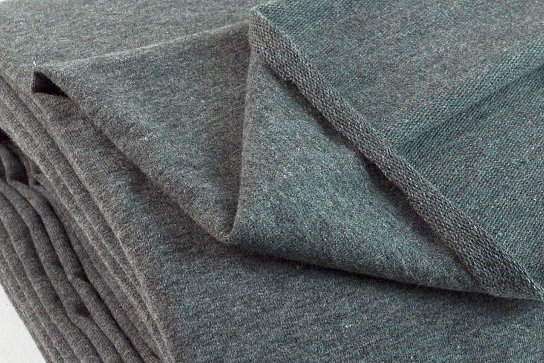

Gebreide stof is stof die gebreid is in plaats van geweven. Gebreide stof heeft meestal wat stretch.

Hoewel de stof gebreid is ziet ze er niet uit als breiwerk, maar als stof.

Gebreide stof wordt gebruikt voor kledingstukken waar stretch nodig is. Ze worden vaak met een overlock genaaid om de stretch in de naden te behouden.

> Wikipedia heeft meer te zeggen over breisel: [Knitted fabric in Wikipedia](http://en.wikipedia.org/wiki/Knitted_fabric)
