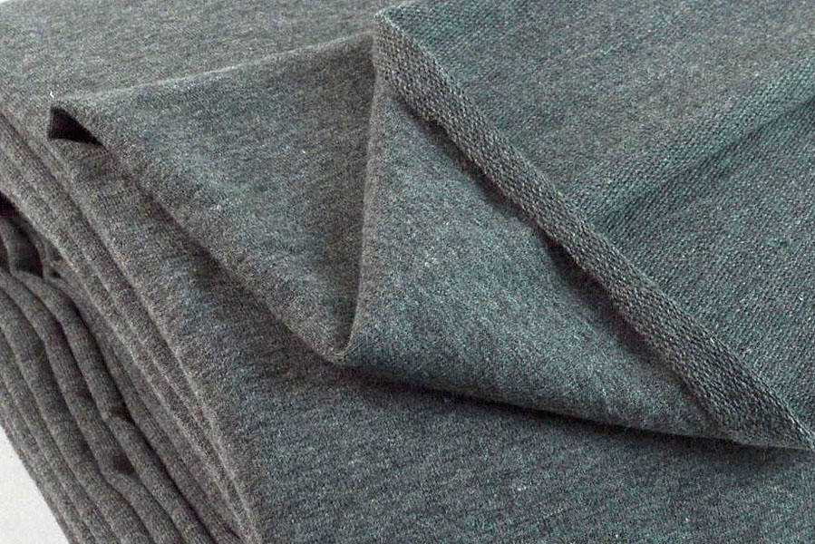

Трикотаж - це тканина, яка в'яжеться, а не тчеться. Трикотаж зазвичай певною мірою розтягується.

Хоча тканина трикотажна, вона виглядає не як трикотаж, а як тканина.

Трикотажне полотно використовується в одязі, де необхідна розтяжність. Їх часто зшивають сервером, щоб зберегти розтягнення швів.

> Вікіпедія може більше розповісти про трикотаж: [Трикотаж у Вікіпедії](http://en.wikipedia.org/wiki/Knitted_fabric)
