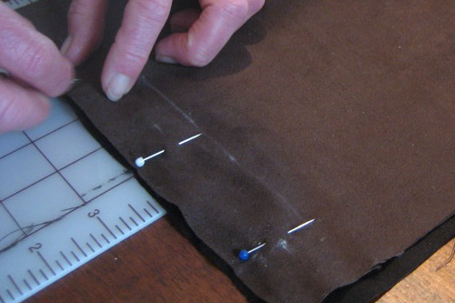

Pinning wird immer dann verwendet, wenn Sie Nähstifte verwenden, um die Dinge an der Stelle zu halten.

Beispiele für die häufige Verwendung von Pinning sind:

 - Nähen einer Naht vor dem Nähen
 - Einen Ornament, eine Tasche oder einen anderen Teil vor dem Anhängen anlegen
 - Das Pinnen von Darts oder anderen Mustern ändert sich, während das Kleidungsstück auf ein Modell passt

Pinning ist niemals dauerhaft, sondern lediglich eine vorübergehende Maßnahme, um die Dinge in Ordnung zu bringen.

> Pinn- und Bastverfahren sind verschiedene Techniken für ähnliche Situationen

> Bilder von [Kristin Roach](https://www.flickr.com/photos/marlana/113434148) und [Ed Platte](https://www.flickr.com/photos/philentropist/313403963)
