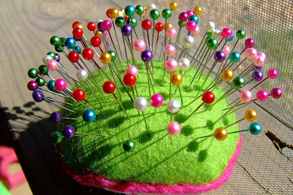
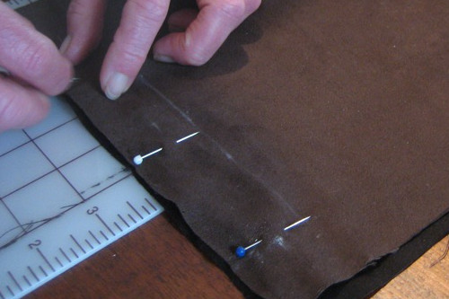

Spelden wordt gebruikt wanneer je kopspelden gebruikt om dingen op hun plek te houden.

Voorbeelden van het gebruik van spelden:

- Een naad vastspelden voor ze te naaien
- Een decoratie, zak of ander element op zijn plek spelden voor het te bevestigen
- Nepen of andere patroonaanpassingen spelden terwijl je het kledingstuk past op een model

Spelden is nooit permanent, maar een tijdelijke manier om dingen op hun plek te houden.

> Spelden en driegen zijn verschillende technieken voor gelijkaardige situaties

> Foto's door [Kristin Roach](https://www.flickr.com/photos/marlana/113434148) en [Ed Platt](https://www.flickr.com/photos/philentropist/313403963)
