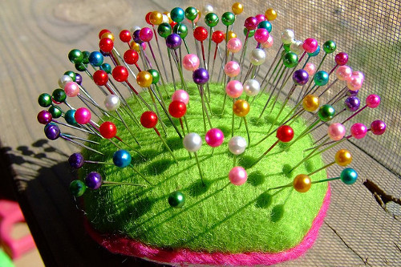

Приколювання використовується щоразу, коли ви використовуєте швейні шпильки, щоб утримувати речі на місці.

Приклади того, де зазвичай використовується піннінг::

- Закріплення шва перед тим, як зшити його
- Закріплення прикраси, кишені або іншої деталі на місці перед тим, як прикріпити її
- Приколювання виточок або інших змін викрійки під час примірки виробу на моделі

Закріплення ніколи не є постійним, а лише тимчасовим заходом, щоб утримати речі на місці.

> Закріплення та наклеювання - це різні техніки для схожих ситуацій

> Фото: [Крістін Роуч](https://www.flickr.com/photos/marlana/113434148) та [Ед Платт](https://www.flickr.com/photos/philentropist/313403963)
