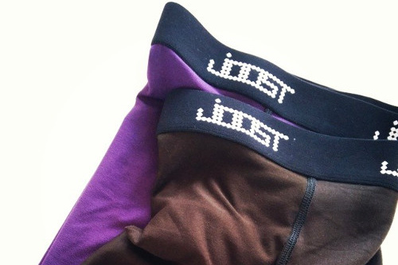

Rayon, manchmal auch als Viskose bezeichnet, ist eine synthetische Faser. Es stammt aus Holz, aber es gibt viele chemische Haken zu durchspringen, bevor es aus Gewebe wird.

Da es sich um eine Faser handelt (wie Baumwolle) hängt der daraus resultierende Stoff davon ab, wie er gewebt wird. Allerdings ist im Allgemeinen Strayon ein vielseitiges Stoff, das glatt zur Berührung, Drapes, und ist etwas rutschig.

Rayon ist kein guter Isolator der Körperwärme. Das macht es zu einer schlechten Wahl für ein Wintermantel, aber eine gute Wahl für Ihre Sommerkleider oder Unterwäsche.

> Wikipedia hat viel über Rayon: [Rayon auf Wikipedia](http://en.wikipedia.org/wiki/Rayon)
