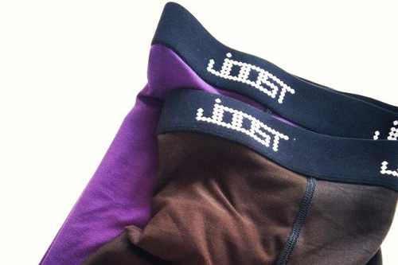

Віскоза, яку іноді називають віскозою, є синтетичним волокном. Вона походить з деревної целюлози, але перед тим, як стати тканиною, вона проходить безліч хімічних обручів.

Оскільки віскоза - це волокно (як і бавовна), отримана тканина буде залежати від способу її переплетення. Проте загалом віскоза - це універсальна тканина, яка гладенька на дотик, драпірується і є дещо слизькою.

Віскоза не є добрим ізолятором тепла тіла. Це робить його поганим вибором для зимового пальто, але хорошим вибором для літніх суконь або нижньої білизни.

> Вікіпедія може багато розповісти про район: [Район у Вікіпедії](http://en.wikipedia.org/wiki/Rayon)
