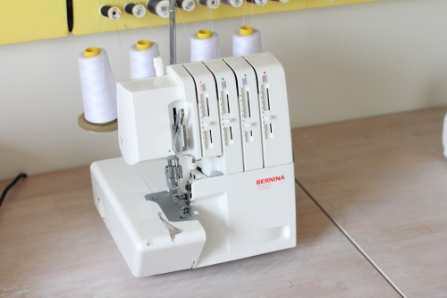

Ein Serger oder Overlock ist eine Art Nähmaschine, die sowohl Stoff schneiden und einen Stretchverschluss machen kann.

Serger verwenden mehrere Fäden und Nadeln, um nicht nur die Naht zu machen, sondern auch das Gewebe zu verriegeln. Sie werden sehr oft mit Strickwaren oder anderen Dehnstoffen verwendet.

> Der Begriff Übersperre ist in Europa häufiger für einen Server. Allerdings ziehe ich es vor, Serger zu verwenden, da er Verwirrung zwischen den sehr ähnlich benannten Overlock und Coverlock Maschinen vermeidet.
> 
> Weitere Verwirrung entsteht durch die Tatsache, dass einige Nähmaschinen einen Überschlussstich haben, der die Rolle eines Sergers nachahmt.
> 
> Um all dies zu vermeiden, verwende ich Serger, um auf die dedizierte Maschine zu verweisen.
