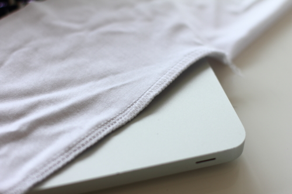
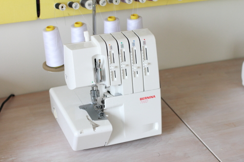

A serger or overlock is a type of sewing machine that can both cut fabric and make a stretch lockstitch.

Sergers use multiple threads and needles to not only make the seam, but also lock the fabric. They are very often used with knit or other stretchy fabrics.

> The term overlock is more common in Europe for a serger. However, I prefer to use serger as it avoids confusion between the very similar named overlock and coverlock machines.
>
> Further confusion is added by the fact that some sewing machines have an overlock stitch that mimics the role of a serger.
>
> To steer clear of all this, I use serger to refer to the dedicated machine.
