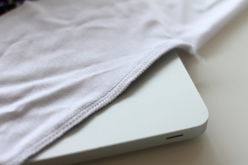

Une surjeteuse est un type de machine à coudre qui peut à la fois couper le tissu, le surjeter et faire un point d'assemblage extensible.

Les surjeteuses utilisent plusieurs fils et aiguilles pour non seulement faire la couture, mais aussi surfiler le tissu. Elles sont très souvent utilisées pour les tissus maille ou autres tissus extensibles.

> Le terme "surjeteuse" est plus courant en Europe. Cependant il existe en anglais un abus de langage où Surjeteuse (serger) et Surfileuses (Overlock) sont confondues. En effet, la surfileuse ne fait que surfiler le tissu ; elle ne coupe pas et n'assemble pas les tissus. Cette dernière est surtout utilisée en milieu professionnel.
> 
> Une autre confusion est ajoutée par le fait que certaines machines à coudre ont un point de surjet qui imite le rôle d'une surjeteuse.
> 
> Pour éviter tout cela, j'utilise le terme surjeteuse pour faire référence à la machine dédiée.
