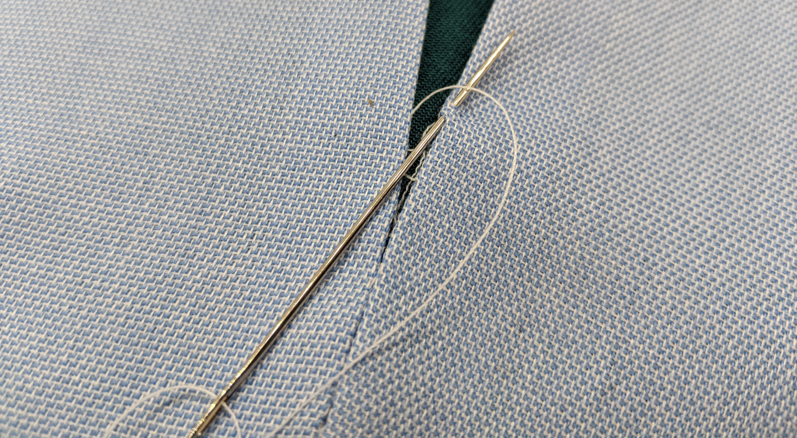

Un point glissé est une technique de couture à la main qui vous permet de joindre les épaisseurs de tissu avec un point invisible de l'extérieur. Un point glissé est _glissé_ entre les épaisseurs de tissu où il coud ensemble les marges de coutures.

