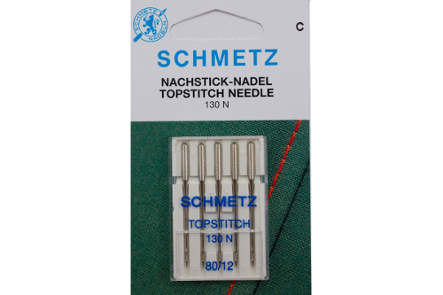

Sierstiksel wordt met de goede kant van de stof bovenaan gedaan, en houdt in dat je steken zichtbaar zijn op het afgewerkte kledingstuk.

Het kan zowel decoratief zijn als functioneel bij de constructie van een kledingstuk.

> Je kan speciale naaimachinenaalden kopen die bedoeld zijn voor sierstiksel
