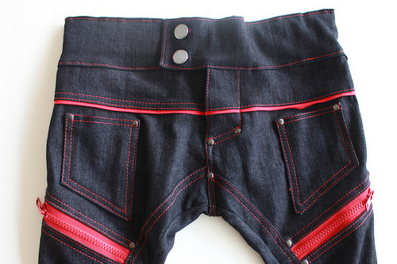
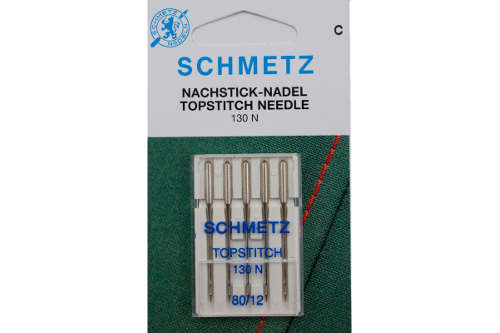

Поверхневий шов або поверхневий стібок утворюється шляхом стьобання лицьовим боком тканини догори, в результаті чого стібки видно на готовому виробі.

Поверхневий шов є переважно оздоблювальним, однак також може виконувати структурну функцію.

> Ви можете придбати особливі голки для виконання поверхневого шва
