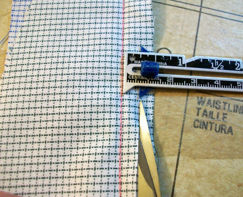

Cortar o recortar está recortando [exceso de permisos de costura](/docs/sewing/seam-allowance).

A menudo el objetivo de la trinchera es reducir la masa en las costuras de una prenda.

> Imagen de [Heather](http://www.feathersflights.com/2011/02/trimming-and-grading-seams.html)
