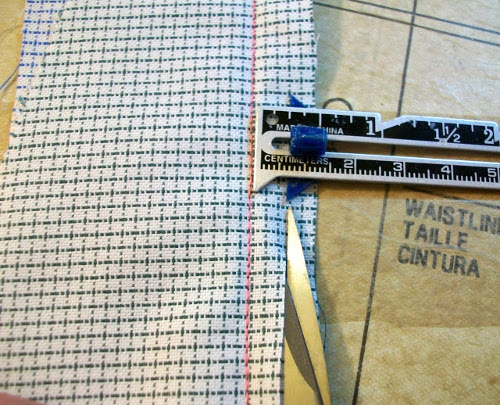

Le découpage, ou pour garnir, est de couper une marge de [couture excessive](/docs/sewing/seam-allowance).

Souvent le but de dégarnir est de réduire l'excès de matière dans les coutures d'un vêtement.

> Photo de [Heather](http://www.feathersflights.com/2011/02/trimming-and-grading-seams.html)
