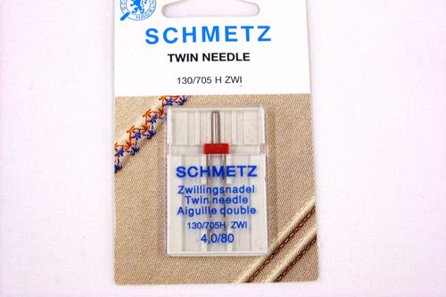

Una aguja gemela es útil para cuando se necesita coser la parte superior estirable (como cuando se emite un tejido). También puedes usarlo para un efecto decorativo.

Mientras que una máquina de cerradura está construida con el propósito de producir un pico estirable, no todo el mundo tiene tal máquina. Una aguja gemela utiliza dos hilos superiores y una sola debajo del hilo. Esto causa un efecto zig-zag en la espalda, haciendo que la stitch se pueda estirar. Mientras tanto, se obtienen dos líneas paralelas de empate en el frente.

> GIF animado por [Ashley](http://www.makeit-loveit.com/2011/05/sewing-tips-basic-stitches-plus-double.html)
