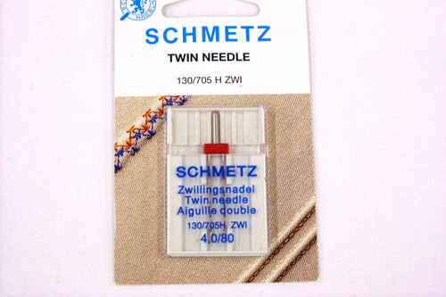
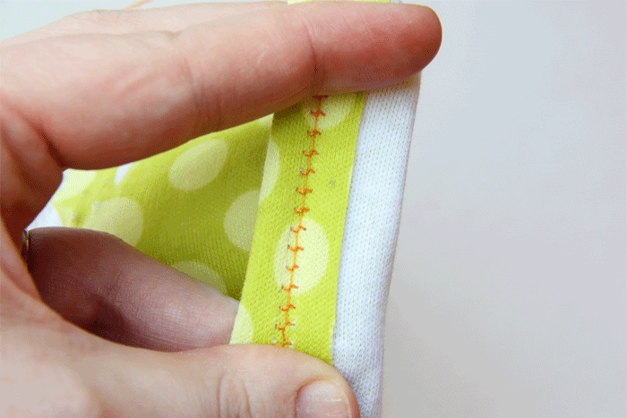

Une aiguille double est utile lorsque vous avez besoin de faire des surpiqûres extensibles (comme pour l'ourlet d'un tissu maille). Vous pouvez également l'utiliser pour un effet décoratif.

Bien qu'une recouvreuse soit spécialement conçue pour faire un point de surpiqûre extensible, tout le monde ne dispose pas d'une telle machine. Une aiguille double utilise deux fils supérieurs et un seul fil de canette. Cela provoque un effet zig-zag sur l'arrière, rendant le point extensible. Pendant ce temps, vous obtenez deux lignes parallèles de couture à l'avant.

> GIF animé par [Ashley](http://www.makeit-loveit.com/2011/05/sewing-tips-basic-stitches-plus-double.html)
