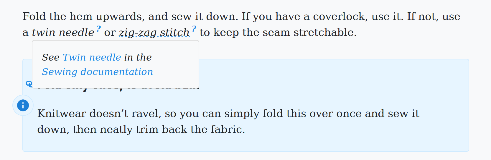

<p align='center'><a
  href="https://www.npmjs.com/package/gatsby-remark-jargon"
  title="gatsby-remark-jargon on NPM"
  >
  </a><a
  href="https://opensource.org/licenses/MIT"
  title="License: MIT"
  >
  </a><a
  href="https://deepscan.io/dashboard#view=project&tid=2114&pid=2993&bid=23256"
  title="Code quality on DeepScan"
  >
  </a><a
  href="https://github.com/freesewing/freesewing/issues?q=is%3Aissue+is%3Aopen+label%3Apkg%3Agatsby-remark-jargon"
  title="Open issues tagged pkg:gatsby-remark-jargon"
  >
  </a><a
  href="#contributors-"
  title="All Contributors"
  >
  </a></p><p align='center'><a
  href="https://twitter.com/freesewing_org"
  title="Follow @freesewing_org on Twitter"
  >
  </a><a
  href="https://chat.freesewing.org"
  title="Chat with us on Discord"
  >
  </a><a
  href="https://freesewing.org/patrons/join"
  title="Become a FreeSewing Patron"
  >
  </a><a
  href="https://instagram.com/freesewing_org"
  title="Follow @freesewing_org on Twitter"
  >
  </a></p>

# gatsby-remark-jargon

A gatsby-transformer-remark sub-plugin for jargon terms

## About

This wraps the [remark-jargon](https://github.com/freesewing/freesewing/tree/develop/packages/remark-jargon) plugin
for Gatsby so you can use _jargon_ in the markdown/mdx of your Gatsby site:



## Install

```bash
npm install --save gatsby-remark-jargon
```

## Configuration


In `gatsby-config.js` include your jargon file, and add the remark plugin:


```js
  {
    resolve: 'gatsby-remark-jargon',
    options: { jargon: require('./jargon.js') }
  }
```

## Usage

### The jargon file

The jagon file is a simple key-value file:

```js
const jargon = {
  msf: "<b>MSF</b> Médecins Sans Frontières / Doctors Without Borders — An international, independent, medical humanitarian organisation. See <a href='https://www.msf.org/'>msf.org</a>"
}

export default jargon
```

### Using jargon in markdown

This plugin will only add markup to your jargon if you emphasize it. In the following example, 
only the first mention of MSF will be changed:

```md
_MSF_ was founded in 1971 by 13 doctors and journalists. Today, MSF is a worldwide movement of more than 67,000 people.
```

This will be rendered as:

```html
<p>
  <em>
    <span class="jargon-term">
      MSF
      <span class="jargon-info">
        <b>MSF</b> Médecins Sans Frontières / Doctors Without Borders — An international, independent, medical humanitarian organisation. See <a href='https://www.msf.org/'>msf.org</a>
      </span>
    </span>
  </em>
  was founded in 1971 by 13 doctors and journalists. Today, MSF is a worldwide movement of more than 67,000 people.
</p>
```

Which you can then style so that the definition is only show on hover/touch.

### Styling your jargon

You will need to add CSS to style your jargon properly, and hide the definition by default.
Below is an example to get you started:

```css
// Add a dashed line under jargon terms
.jargon-term {
  text-decoration: underline dotted #228be6
}
// Add a question mark behind/above jargon terms
.jargon-term::after {
  content: "?";
  font-weight: bold;
  display: inline-block;
  transform: translate(0, -0.5em);
  font-size: 75%;
  color: #228be6;
  margin-left: 3px;
}
// Hover behavior for the therm itself
.jargon-term:hover {
  position: relative;
  text-decoration: none;
  cursor: help;
}
// Hide info by default
.jargon-term .jargon-info {
  display: none
}
// Show info on hover
.jargon-term:hover .jargon-info {
  display: block;
  position: absolute;
  top: 1.5em;
  left: 0;
  background: #F8F8F8;
  border: 1px solid #DCDCDC;
  padding: 1rem;
  border-radius: 4px;
  font-size: 90%;
  min-width: 250px;
  max-width: 450px;
  z-index: 1;
}
```

## Tips for using jargon

### Lowercase your terms in the jargon file

When looking for terms to match, we lowercase the term your emphazised.
So in the jargon file, you should use `msf`, but in your text, you can use `MSF`, `Msf`, or `msf`.

### If you use HTML, only use inline elements

Your jargon term definition can contain HTML, but only inline elements.
Typically, you will want to stick to:

 - Making things **bold**
 - Inserting [links](#)


## What am I looking at? 🤔

This repository is our *monorepo* 
holding [all our NPM packages](https://freesewing.dev/reference/packages/).  

This folder holds: gatsby-remark-jargon

## About FreeSewing 💀

Where the world of makers and developers collide, that's where you'll find FreeSewing.

If you're a maker, checkout [freesewing.org](https://freesewing.org/) where you can generate
our sewing patterns adapted to your measurements.

If you're a developer, our documentation is on [freesewing.dev](https://freesewing.dev/).
Our [core library](https://freesewing.dev/reference/api/) is a *batteries-included* toolbox
for parametric design of sewing patterns. But we also provide a range 
of [plugins](https://freesewing.dev/reference/plugins/) that further extend the 
functionality of the platform.

If you have NodeJS installed, you can try it right now by running:

```bash
npx create-freesewing-pattern
```

Or, consult our getting started guides 
for [Linux](https://freesewing.dev/tutorials/getting-started-linux/),
[MacOS](https://freesewing.dev/tutorials/getting-started-mac/), 
or [Windows](https://freesewing.dev/tutorials/getting-started-windows/).

We also have a [pattern design tutorial](https://freesewing.dev/tutorials/pattern-design/) that
walks you through your first parametric design, 
and [a friendly community](https://freesewing.org/community/where/) with 
people who can help you when you get stuck.

## Support FreeSewing: Become a patron 🥰

FreeSewing is an open source project run by a community, 
and financially supported by our patrons.

If you feel what we do is worthwhile, and you can spend a few coind without
hardship, then you should [join us and become a patron](https://freesewing.org/community/join).

## Links 👩‍💻

 - 💻 Makers website: [freesewing.org](https://freesewing.org)
 - 💻 Developers website: [freesewing.dev](https://freesewing.dev)
 - 💬 Chat: On Discord via [discord.freesewing.org](https://discord.freesewing.org/)
 - ✅ Todo list/Kanban board: On Github via [todo.freesewing.org](https://todo.freesewing.org/)
 - 🐦 Twitter: [@freesewing_org](https://twitter.com/freesewing_org)
 - 📷 Instagram: [@freesewing_org](https://instagram.com/freesewing_org)

## License: MIT 🤓

© [Joost De Cock](https://github.com/joostdecock).  
See [the license file](https://github.com/freesewing/freesewing/blob/develop/LICENSE) for details.

## Where to get help 🤯

Our [chatrooms on Discord](https://chat.freesewing.org/) are the best place to ask questions,
share your feedback, or just hang out.

If you want to report a problem, please [create an issue](https://github.com/freesewing/freesewing/issues/new).


## Contributors ✨

Thanks goes to these wonderful people ([emoji key](https://allcontributors.org/docs/en/emoji-key)):

<!-- ALL-CONTRIBUTORS-LIST:START - Do not remove or modify this section -->
<!-- prettier-ignore-start -->
<!-- markdownlint-disable -->
<table>
  <tr>
    <td align="center"><a href="http://adamrtomkins.github.io/"><br /><sub><b>Adam Tomkins</b></sub></a><br /><a href="https://github.com/freesewing/freesewing/commits?author=AdamRTomkins" title="Documentation">📖</a></td>
    <td align="center"><a href="http://polymerisation-des-concepts.fr/"><br /><sub><b>Alexandre Ignjatovic</b></sub></a><br /><a href="https://github.com/freesewing/freesewing/commits?author=bankair" title="Code">💻</a></td>
    <td align="center"><a href="https://github.com/AlfaLyr"><br /><sub><b>AlfaLyr</b></sub></a><br /><a href="https://github.com/freesewing/freesewing/commits?author=AlfaLyr" title="Code">💻</a> <a href="#plugin-AlfaLyr" title="Plugin/utility libraries">🔌</a> <a href="#design-AlfaLyr" title="Design">🎨</a></td>
    <td align="center"><a href="http://thelettereph.com"><br /><sub><b>Andrew James</b></sub></a><br /><a href="https://github.com/freesewing/freesewing/commits?author=ephphatha" title="Documentation">📖</a></td>
    <td align="center"><a href="https://github.com/annekecaramin"><br /><sub><b>Anneke</b></sub></a><br /><a href="https://github.com/freesewing/freesewing/commits?author=annekecaramin" title="Documentation">📖</a> <a href="#translation-annekecaramin" title="Translation">🌍</a></td>
    <td align="center"><a href="https://github.com/anniekao"><br /><sub><b>Annie Kao</b></sub></a><br /><a href="https://github.com/freesewing/freesewing/commits?author=anniekao" title="Documentation">📖</a></td>
    <td align="center"><a href="https://github.com/Anternative"><br /><sub><b>Anternative</b></sub></a><br /><a href="https://github.com/freesewing/freesewing/commits?author=Anternative" title="Documentation">📖</a></td>
  </tr>
  <tr>
    <td align="center"><a href="https://github.com/Quiltmaster"><br /><sub><b>Anthony</b></sub></a><br /><a href="#question-Quiltmaster" title="Answering Questions">💬</a></td>
    <td align="center"><a href="https://github.com/camerondubas"><br /><sub><b>Cameron Dubas</b></sub></a><br /><a href="https://github.com/freesewing/freesewing/commits?author=camerondubas" title="Documentation">📖</a></td>
    <td align="center"><a href="https://github.com/cabi"><br /><sub><b>Carsten Biebricher</b></sub></a><br /><a href="https://github.com/freesewing/freesewing/commits?author=cabi" title="Documentation">📖</a></td>
    <td align="center"><a href="https://github.com/cathyzoller"><br /><sub><b>Cathy Zoller</b></sub></a><br /><a href="https://github.com/freesewing/freesewing/commits?author=cathyzoller" title="Documentation">📖</a></td>
    <td align="center"><a href="https://github.com/Chantalbijoux"><br /><sub><b>Chantal Lapointe</b></sub></a><br /><a href="#translation-Chantalbijoux" title="Translation">🌍</a></td>
    <td align="center"><a href="https://github.com/dpiquet"><br /><sub><b>Damien PIQUET</b></sub></a><br /><a href="https://github.com/freesewing/freesewing/commits?author=dpiquet" title="Code">💻</a></td>
    <td align="center"><a href="https://www.darigovresearch.com/"><br /><sub><b>Darigov Research</b></sub></a><br /><a href="https://github.com/freesewing/freesewing/commits?author=darigovresearch" title="Documentation">📖</a> <a href="#ideas-darigovresearch" title="Ideas, Planning, & Feedback">🤔</a></td>
  </tr>
  <tr>
    <td align="center"><a href="https://github.com/ElenaFdR"><br /><sub><b>Elena FdR</b></sub></a><br /><a href="https://github.com/freesewing/freesewing/commits?author=ElenaFdR" title="Documentation">📖</a> <a href="#blog-ElenaFdR" title="Blogposts">📝</a></td>
    <td align="center"><a href="https://emmanuelnyachoke.com/"><br /><sub><b>Emmanuel Nyachoke</b></sub></a><br /><a href="https://github.com/freesewing/freesewing/commits?author=enyachoke" title="Code">💻</a> <a href="https://github.com/freesewing/freesewing/commits?author=enyachoke" title="Documentation">📖</a></td>
    <td align="center"><a href="https://github.com/EvEkSwed"><br /><sub><b>EvEkSwed</b></sub></a><br /><a href="#translation-EvEkSwed" title="Translation">🌍</a></td>
    <td align="center"><a href="https://github.com/Fantastik-Maman"><br /><sub><b>Fantastik-Maman</b></sub></a><br /><a href="#translation-Fantastik-Maman" title="Translation">🌍</a></td>
    <td align="center"><a href="https://www.forresto.com/"><br /><sub><b>Forrest O.</b></sub></a><br /><a href="https://github.com/freesewing/freesewing/commits?author=forresto" title="Documentation">📖</a></td>
    <td align="center"><a href="https://www.linkedin.com/in/glennfmatthews/"><br /><sub><b>Glenn Matthews</b></sub></a><br /><a href="https://github.com/freesewing/freesewing/commits?author=glennmatthews" title="Documentation">📖</a></td>
    <td align="center"><a href="https://github.com/Irapeke"><br /><sub><b>Irapeke</b></sub></a><br /><a href="#translation-Irapeke" title="Translation">🌍</a></td>
  </tr>
  <tr>
    <td align="center"><a href="https://github.com/jsawo"><br /><sub><b>Jacek Sawoszczuk</b></sub></a><br /><a href="https://github.com/freesewing/freesewing/commits?author=jsawo" title="Documentation">📖</a></td>
    <td align="center"><a href="https://github.com/jgfichte"><br /><sub><b>Jason Williams</b></sub></a><br /><a href="https://github.com/freesewing/freesewing/commits?author=jgfichte" title="Documentation">📖</a></td>
    <td align="center"><a href="https://github.com/jejacks0n"><br /><sub><b>Jeremy Jackson</b></sub></a><br /><a href="https://github.com/freesewing/freesewing/commits?author=jejacks0n" title="Code">💻</a></td>
    <td align="center"><a href="https://github.com/Joebidido"><br /><sub><b>Joebidido</b></sub></a><br /><a href="#translation-Joebidido" title="Translation">🌍</a></td>
    <td align="center"><a href="https://joost.at/"><br /><sub><b>Joost De Cock</b></sub></a><br /><a href="#maintenance-joostdecock" title="Maintenance">🚧</a></td>
    <td align="center"><a href="https://github.com/joshessman"><br /><sub><b>Josh Essman</b></sub></a><br /><a href="https://github.com/freesewing/freesewing/commits?author=joshessman" title="Documentation">📖</a></td>
    <td align="center"><a href="http://www.earth.li/~kake/"><br /><sub><b>Kake</b></sub></a><br /><a href="https://github.com/freesewing/freesewing/commits?author=KakeLP" title="Documentation">📖</a></td>
  </tr>
  <tr>
    <td align="center"><a href="https://twitter.com/kapunahele"><br /><sub><b>Kapunahele Wong</b></sub></a><br /><a href="https://github.com/freesewing/freesewing/commits?author=kapunahelewong" title="Documentation">📖</a></td>
    <td align="center"><a href="https://github.com/tangerineshark"><br /><sub><b>Karen</b></sub></a><br /><a href="https://github.com/freesewing/freesewing/commits?author=tangerineshark" title="Documentation">📖</a> <a href="#eventOrganizing-tangerineshark" title="Event Organizing">📋</a></td>
    <td align="center"><a href="https://github.com/mcgnly"><br /><sub><b>Katie McGinley</b></sub></a><br /><a href="https://github.com/freesewing/freesewing/commits?author=mcgnly" title="Documentation">📖</a></td>
    <td align="center"><a href="http://www.kieranklaassen.com/"><br /><sub><b>Kieran Klaassen</b></sub></a><br /><a href="https://github.com/freesewing/freesewing/commits?author=kieranklaassen" title="Code">💻</a></td>
    <td align="center"><a href="https://github.com/Kittycatou"><br /><sub><b>Kittycatou</b></sub></a><br /><a href="#translation-Kittycatou" title="Translation">🌍</a></td>
    <td align="center"><a href="https://www.krishoward.org/"><br /><sub><b>Kris</b></sub></a><br /><a href="https://github.com/freesewing/freesewing/commits?author=web-goddess" title="Documentation">📖</a></td>
    <td align="center"><a href="https://github.com/kristinruben"><br /><sub><b>Kristin Ruben</b></sub></a><br /><a href="https://github.com/freesewing/freesewing/commits?author=kristinruben" title="Code">💻</a></td>
  </tr>
  <tr>
    <td align="center"><a href="https://github.com/Loudepeuter"><br /><sub><b>Loudepeuter</b></sub></a><br /><a href="#translation-Loudepeuter" title="Translation">🌍</a></td>
    <td align="center"><a href="https://github.com/lucibytes"><br /><sub><b>Lucian</b></sub></a><br /><a href="#eventOrganizing-lucibytes" title="Event Organizing">📋</a></td>
    <td align="center"><a href="https://github.com/manufakturedelweiss"><br /><sub><b>Marcus</b></sub></a><br /><a href="#translation-manufakturedelweiss" title="Translation">🌍</a></td>
    <td align="center"><a href="https://github.com/martintribo"><br /><sub><b>Martin Tribo</b></sub></a><br /><a href="https://github.com/freesewing/freesewing/commits?author=martintribo" title="Documentation">📖</a></td>
    <td align="center"><a href="https://github.com/nadege"><br /><sub><b>Nadege Michel</b></sub></a><br /><a href="https://github.com/freesewing/freesewing/commits?author=nadege" title="Tests">⚠️</a> <a href="https://github.com/freesewing/freesewing/commits?author=nadege" title="Documentation">📖</a></td>
    <td align="center"><a href="https://github.com/nataliasayang"><br /><sub><b>Natalia</b></sub></a><br /><a href="https://github.com/freesewing/freesewing/commits?author=nataliasayang" title="Code">💻</a> <a href="#design-nataliasayang" title="Design">🎨</a> <a href="#blog-nataliasayang" title="Blogposts">📝</a></td>
    <td align="center"><a href="http://yergler.net/"><br /><sub><b>Nathan Yergler</b></sub></a><br /><a href="https://github.com/freesewing/freesewing/commits?author=nyergler" title="Documentation">📖</a></td>
  </tr>
  <tr>
    <td align="center"><a href="https://github.com/nicholasdower"><br /><sub><b>Nick Dower</b></sub></a><br /><a href="https://github.com/freesewing/freesewing/commits?author=nicholasdower" title="Documentation">📖</a> <a href="https://github.com/freesewing/freesewing/commits?author=nicholasdower" title="Code">💻</a> <a href="https://github.com/freesewing/freesewing/issues?q=author%3Anicholasdower" title="Bug reports">🐛</a></td>
    <td align="center"><a href="https://pat.forringer.com/"><br /><sub><b>Patrick Forringer</b></sub></a><br /><a href="#plugin-destos" title="Plugin/utility libraries">🔌</a></td>
    <td align="center"><a href="http://pd75.github.io/"><br /><sub><b>Paul</b></sub></a><br /><a href="https://github.com/freesewing/freesewing/commits?author=PD75" title="Documentation">📖</a> <a href="#blog-PD75" title="Blogposts">📝</a> <a href="#translation-PD75" title="Translation">🌍</a></td>
    <td align="center"><a href="https://github.com/phillipthelen"><br /><sub><b>Phillip Thelen</b></sub></a><br /><a href="https://github.com/freesewing/freesewing/commits?author=phillipthelen" title="Code">💻</a></td>
    <td align="center"><a href="https://github.com/Pixieish"><br /><sub><b>Pixieish</b></sub></a><br /><a href="https://github.com/freesewing/freesewing/commits?author=Pixieish" title="Documentation">📖</a></td>
    <td align="center"><a href="https://www.uza.be/persoon/prof-dr-sorcha-ni-dhubhghaill"><br /><sub><b>Prof. dr. Sorcha Ní Dhubhghaill</b></sub></a><br /><a href="https://github.com/freesewing/freesewing/commits?author=sorchanidhubhghaill" title="Documentation">📖</a></td>
    <td align="center"><a href="https://github.com/QuentinFelix"><br /><sub><b>Quentin FELIX</b></sub></a><br /><a href="https://github.com/freesewing/freesewing/commits?author=QuentinFelix" title="Code">💻</a> <a href="#design-QuentinFelix" title="Design">🎨</a></td>
  </tr>
  <tr>
    <td align="center"><a href="https://github.com/RikHekker"><br /><sub><b>Rik Hekker</b></sub></a><br /><a href="https://github.com/freesewing/freesewing/issues?q=author%3ARikHekker" title="Bug reports">🐛</a></td>
    <td align="center"><a href="http://resume.livingston-gray.com/faq.html"><br /><sub><b>Sam Livingston-Gray</b></sub></a><br /><a href="https://github.com/freesewing/freesewing/commits?author=geeksam" title="Documentation">📖</a></td>
    <td align="center"><a href="https://github.com/sannek"><br /><sub><b>Sanne</b></sub></a><br /><a href="https://github.com/freesewing/freesewing/commits?author=sannek" title="Code">💻</a> <a href="https://github.com/freesewing/freesewing/commits?author=sannek" title="Documentation">📖</a></td>
    <td align="center"><a href="https://github.com/Tyrannogina"><br /><sub><b>Sara Latorre</b></sub></a><br /><a href="#translation-Tyrannogina" title="Translation">🌍</a></td>
    <td align="center"><a href="https://www.instagram.com/celine_mge/"><br /><sub><b>Slylele</b></sub></a><br /><a href="https://github.com/freesewing/freesewing/commits?author=Slylele" title="Documentation">📖</a> <a href="#translation-Slylele" title="Translation">🌍</a></td>
    <td align="center"><a href="https://github.com/Soazillon"><br /><sub><b>Soazillon</b></sub></a><br /><a href="#translation-Soazillon" title="Translation">🌍</a></td>
    <td align="center"><a href="http://metafly.info/"><br /><sub><b>Stefan Sydow</b></sub></a><br /><a href="#translation-stsydow" title="Translation">🌍</a> <a href="https://github.com/freesewing/freesewing/commits?author=stsydow" title="Documentation">📖</a></td>
  </tr>
  <tr>
    <td align="center"><a href="https://github.com/TriploidTree"><br /><sub><b>Tríona</b></sub></a><br /><a href="https://github.com/freesewing/freesewing/commits?author=TriploidTree" title="Documentation">📖</a></td>
    <td align="center"><a href="https://github.com/theUnmutual"><br /><sub><b>Unmutual</b></sub></a><br /><a href="https://github.com/freesewing/freesewing/commits?author=theUnmutual" title="Documentation">📖</a></td>
    <td align="center"><a href="https://github.com/woutervdub"><br /><sub><b>Wouter van Wageningen</b></sub></a><br /><a href="https://github.com/freesewing/freesewing/commits?author=woutervdub" title="Code">💻</a> <a href="#design-woutervdub" title="Design">🎨</a> <a href="#tool-woutervdub" title="Tools">🔧</a></td>
    <td align="center"><a href="https://github.com/amysews"><br /><sub><b>amysews</b></sub></a><br /><a href="https://github.com/freesewing/freesewing/commits?author=amysews" title="Documentation">📖</a></td>
    <td align="center"><a href="https://github.com/beautifulsummermoon"><br /><sub><b>beautifulsummermoon</b></sub></a><br /><a href="#translation-beautifulsummermoon" title="Translation">🌍</a></td>
    <td align="center"><a href="https://github.com/berce"><br /><sub><b>berce</b></sub></a><br /><a href="https://github.com/freesewing/freesewing/commits?author=berce" title="Documentation">📖</a></td>
    <td align="center"><a href="https://github.com/biou"><br /><sub><b>biou</b></sub></a><br /><a href="https://github.com/freesewing/freesewing/commits?author=biou" title="Code">💻</a></td>
  </tr>
  <tr>
    <td align="center"><a href="https://github.com/bobgeorgethe3rd"><br /><sub><b>bobgeorgethe3rd</b></sub></a><br /><a href="https://github.com/freesewing/freesewing/commits?author=bobgeorgethe3rd" title="Code">💻</a> <a href="https://github.com/freesewing/freesewing/commits?author=bobgeorgethe3rd" title="Documentation">📖</a> <a href="#design-bobgeorgethe3rd" title="Design">🎨</a></td>
    <td align="center"><a href="https://github.com/brmlyklr"><br /><sub><b>brmlyklr</b></sub></a><br /><a href="https://github.com/freesewing/freesewing/commits?author=brmlyklr" title="Documentation">📖</a></td>
    <td align="center"><a href="http://www.chrisbarrett.fr"><br /><sub><b>chri5b</b></sub></a><br /><a href="https://github.com/freesewing/freesewing/commits?author=chri5b" title="Code">💻</a> <a href="https://github.com/freesewing/freesewing/commits?author=chri5b" title="Tests">⚠️</a></td>
    <td align="center"><a href="https://github.com/dingcycle"><br /><sub><b>dingcycle</b></sub></a><br /><a href="#translation-dingcycle" title="Translation">🌍</a></td>
    <td align="center"><a href="https://github.com/econo202"><br /><sub><b>econo202</b></sub></a><br /><a href="https://github.com/freesewing/freesewing/commits?author=econo202" title="Documentation">📖</a></td>
    <td align="center"><a href="https://github.com/ericamattos"><br /><sub><b>ericamattos</b></sub></a><br /><a href="#translation-ericamattos" title="Translation">🌍</a></td>
    <td align="center"><a href="https://github.com/fightingrabbit"><br /><sub><b>fightingrabbit</b></sub></a><br /><a href="https://github.com/freesewing/freesewing/commits?author=fightingrabbit" title="Code">💻</a></td>
  </tr>
  <tr>
    <td align="center"><a href="https://github.com/DocSpencer77"><br /><sub><b>gaylyndie</b></sub></a><br /><a href="https://github.com/freesewing/freesewing/commits?author=DocSpencer77" title="Documentation">📖</a></td>
    <td align="center"><a href="https://github.com/grimlokason"><br /><sub><b>grimlokason</b></sub></a><br /><a href="https://github.com/freesewing/freesewing/commits?author=grimlokason" title="Code">💻</a></td>
    <td align="center"><a href="https://weblog.redisdead.net"><br /><sub><b>hellgy</b></sub></a><br /><a href="#design-hellgy" title="Design">🎨</a></td>
    <td align="center"><a href="https://github.com/marckiesel"><br /><sub><b>marckiesel</b></sub></a><br /><a href="#translation-marckiesel" title="Translation">🌍</a></td>
    <td align="center"><a href="https://github.com/starfetch"><br /><sub><b>starfetch</b></sub></a><br /><a href="https://github.com/freesewing/freesewing/commits?author=starfetch" title="Code">💻</a> <a href="https://github.com/freesewing/freesewing/commits?author=starfetch" title="Documentation">📖</a> <a href="#translation-starfetch" title="Translation">🌍</a> <a href="#design-starfetch" title="Design">🎨</a></td>
    <td align="center"><a href="https://github.com/ttimearl"><br /><sub><b>ttimearl</b></sub></a><br /><a href="#content-ttimearl" title="Content">🖋</a></td>
    <td align="center"><a href="https://github.com/chrisgloom"><br /><sub><b>tuesgloomsday</b></sub></a><br /><a href="https://github.com/freesewing/freesewing/commits?author=chrisgloom" title="Documentation">📖</a></td>
  </tr>
  <tr>
    <td align="center"><a href="https://github.com/valadaptive"><br /><sub><b>valadaptive</b></sub></a><br /><a href="https://github.com/freesewing/freesewing/commits?author=valadaptive" title="Code">💻</a></td>
    <td align="center"><a href="https://github.com/viocky"><br /><sub><b>viocky</b></sub></a><br /><a href="#translation-viocky" title="Translation">🌍</a></td>
    <td align="center"><a href="https://github.com/woolishboy"><br /><sub><b>woolishboy</b></sub></a><br /><a href="https://github.com/freesewing/freesewing/commits?author=woolishboy" title="Code">💻</a></td>
    <td align="center"><a href="https://github.com/cloutiy"><br /><sub><b>yc</b></sub></a><br /><a href="#translation-cloutiy" title="Translation">🌍</a></td>
  </tr>
</table>

<!-- markdownlint-restore -->
<!-- prettier-ignore-end -->

<!-- ALL-CONTRIBUTORS-LIST:END -->

This project follows the [all-contributors](https://github.com/all-contributors/all-contributors) specification. Contributions of any kind welcome!

