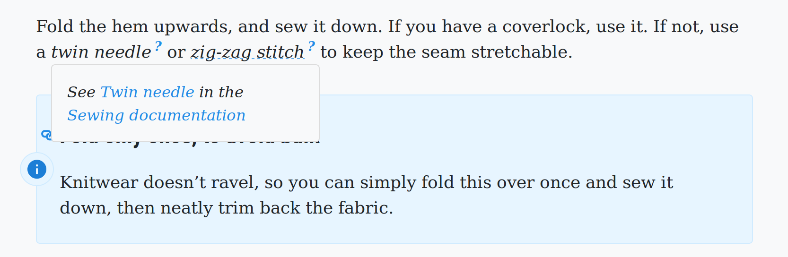

<p align='center'><a
  href="https://www.npmjs.com/package/remark-jargon"
  title="remark-jargon on NPM"
  >
  </a><a
  href="https://opensource.org/licenses/MIT"
  title="License: MIT"
  >
  </a><a
  href="https://deepscan.io/dashboard#view=project&tid=2114&pid=2993&bid=23256"
  title="Code quality on DeepScan"
  >
  </a><a
  href="https://github.com/freesewing/freesewing/issues?q=is%3Aissue+is%3Aopen+label%3Apkg%3Aremark-jargon"
  title="Open issues tagged pkg:remark-jargon"
  >
  </a><a
  href="https://todo.freesewing.org/"
  title="Project board"
  >
  </a></p><p align='center'><a
  href="https://twitter.com/freesewing_org"
  title="Follow @freesewing_org on Twitter"
  >
  </a><a
  href="https://chat.freesewing.org"
  title="Chat with us on Discord"
  >
  </a><a
  href="https://freesewing.org/patrons/join"
  title="Become a FreeSewing Patron"
  >
  </a><a
  href="https://instagram.com/freesewing_org"
  title="Follow @freesewing_org on Twitter"
  >
  </a></p>

# remark-jargon

A Remark plugin for jargon terms

## About

This [Remark](https://remark.js.org/) plugin allows you to use _jargon_ in your 
markdown/mdx content and use a centrally managed file of jargon terms and their definitions.



## Install

To install this plugin, run:

```
npm install --save remark-jargon
```

## Getting started

> **Tip**: See https://github.com/joostdecock/remark-jargon-example for a minimal repository that uses this plugin

### Create your jargon file

This plugin requires a _jargon file_ with terms defenitions. For example:

```js
module.exports = {
  remark: "<b>remark</b> is a markdown processor powered by plugins. See <a href='https://remark.js.org/'>remark.js.org</a>.",
  freesewing: "<b>FreeSewing</b> is an open source platform for made-to-measure sewing patterns. See <a href='https://freesewing.org/'>freesewing.org</a>"
}
```

### Import the plugin

Now import the plugin, and pass it your jargon:

```js
var remark = require('remark')
var html = require('remark-html')
var plugin = require('remark-jargon')
var jargon = require('./jargon.js')

remark()
  .use(html)
  .use(plugin, { jargon: jargon })
  .process('This is a plugin for _remark_ originally written for _freesewing_.', function (err, file) {
    console.log(String(file))
  })
```

> **Note**
>
> This plugin will only add markup to your jargon if you _emphasize_ it.


### Style your jargon

You will need to add CSS to style your jargon properly, and hide the definition by default.
Below is an example to get you started:

```css
// Add a dashed line under jargon terms
.jargon-term {
  text-decoration: underline dotted #228be6
}
// Add a question mark behind/above jargon terms
.jargon-term::after {
  content: "?";
  font-weight: bold;
  display: inline-block;
  transform: translate(0, -0.5em);
  font-size: 75%;
  color: #228be6;
  margin-left: 3px;
}
// Hover behavior for the therm itself
.jargon-term:hover {
  position: relative;
  text-decoration: none;
  cursor: help;
}
// Hide info by default
.jargon-term .jargon-info {
  display: none
}
// Show info on hover
.jargon-term:hover .jargon-info {
  display: block;
  position: absolute;
  top: 1.5em;
  left: 0;
  background: #F8F8F8;
  border: 1px solid #DCDCDC;
  padding: 1rem;
  border-radius: 4px;
  font-size: 90%;
  min-width: 250px;
  max-width: 450px;
  z-index: 1;
}
```

## Tips for using jargon

### Lowercase your terms in the jargon file

When looking for terms to match, we lowercase the term your emphazised.
So in the jargon file, you should use `msf`, but in your text, you can use `MSF`, `Msf`, or `msf`.

### If you use HTML, only use inline elements

Your jargon term definition can contain HTML, but only inline elements.
Typically, you will want to stick to:

 - Making things **bold**
 - Inserting [links](#)

## Getting help

This plugin is written by/for [FreeSewing](https://github.com/freesewing).
For help or feedback, please stop by [the FreeSewing chat room](https://gitter.im/freesewing/development) or
[create an issue](https://github.com/freesewing/freesewing/issues/new).


## Use with Gatsby

Please see [gatsby-remark-jargon](https://github.com/freesewing/freesewing/tree/develop/packages/gatsby-remark-jargon) for
info and instructions on how to use this plugin with [Gatsby](https://www.gatsbyjs.org/). 


## What am I looking at? 🤔

This repository is our *monorepo* 
holding [all our NPM packages](https://freesewing.dev/reference/packages/).  

This folder holds: remark-jargon

## About FreeSewing 💀

Where the world of makers and developers collide, that's where you'll find FreeSewing.

If you're a maker, checkout [freesewing.org](https://freesewing.org/) where you can generate
our sewing patterns adapted to your measurements.

If you're a developer, our documentation is on [freesewing.dev](https://freesewing.dev/).
Our [core library](https://freesewing.dev/reference/api/) is a *batteries-included* toolbox
for parametric design of sewing patterns. But we also provide a range 
of [plugins](https://freesewing.dev/reference/plugins/) that further extend the 
functionality of the platform.

If you have NodeJS installed, you can try it right now by running:

```bash
npx create-freesewing-pattern
```

Or, consult our getting started guides 
for [Linux](https://freesewing.dev/tutorials/getting-started-linux/),
[MacOS](https://freesewing.dev/tutorials/getting-started-mac/), 
or [Windows](https://freesewing.dev/tutorials/getting-started-windows/).

We also have a [pattern design tutorial](https://freesewing.dev/tutorials/pattern-design/) that
walks you through your first parametric design, 
and [a friendly community](https://freesewing.org/community/where/) with 
people who can help you when you get stuck.

## Support FreeSewing: Become a patron 🥰

FreeSewing is an open source project run by a community, 
and financially supported by our patrons.

If you feel what we do is worthwhile, and you can spend a few coind without
hardship, then you should [join us and become a patron](https://freesewing.org/community/join).

## Links 👩‍💻

 - 💻 Makers website: [freesewing.org](https://freesewing.org)
 - 💻 Developers website: [freesewing.dev](https://freesewing.dev)
 - 💬 Chat: On Discord via [chat.freesewing.org](https://chat.freesewing.org/)
 - ✅ Todo list/Kanban board: On Github via [todo.freesewing.org](https://todo.freesewing.org/)
 - 🐦 Twitter: [@freesewing_org](https://twitter.com/freesewing_org)
 - 📷 Instagram: [@freesewing_org](https://instagram.com/freesewing_org)

## License: MIT 🤓

© [Joost De Cock](https://github.com/joostdecock).  
See [the license file](https://github.com/freesewing/freesewing/blob/develop/LICENSE) for details.

## Where to get help 🤯

Our [chatrooms on Discord](https://chat.freesewing.org/) are the best place to ask questions,
share your feedback, or just hang out.

If you want to report a problem, please [create an issue](https://github.com/freesewing/freesewing/issues/new).
