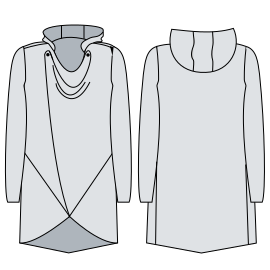

# yuri
Yuri is a fancy zipless cardigan based on the Huey & Hugo hoodies #freesewing #freesewingHuey #freesewingHugo

Try it here : https://yuri-pattern.netlify.app/



[](https://www.npmjs.com/package/yuri) [](https://standardjs.com)

## Install

```bash
npm install --save yuri
```


## What you need
- Sweater fabric
- 2 buttons (2,5cm or 1inch diameter)

## Instructions / how to

### Step 1 :  Sew the shoulders
Match the good sides together and sew the one front piece with the back between the neck and the shoulder.
Repeat with the other front part and the other shoulder of the back.

### Step 2 : Attach the sleeves

- The side of the sleeve with the pointy edge at top is the back of the sleeve piece. It is also marked by a double notch on the pattern.
- Match good sides of the sleeve seam to good sides of the front, matching the single notch on front to single notch on the sleeve piece. Stitch the seam. Do this for both sleeve pieces.
- To finish the seam, you can use one of these methods:
  - Use a serger to sew and finish the seam in one step. This is fast and convenient, but produces a less-refined look.
  - If you do not have a serger, or would like a more refined look, sew a seam with a straight stitch on your conventional machine. Press the seam allowances apart on the wrong side. Then, edgestitch along both sides of the seam from the right side. Finally, trim the excess seam allowance. This produces a refined look, but takes longer.
  - Another serger-free option is to sew the seam with a straight stitch. Then stitch together the seam allowances with an additional line of zig-zag alongside the straight stitch. Finally, trim the excess seam allowance. This simulates what a serger would do.

### Step 3 : Hem the cuffs
As this pattern does not use ribbing, make a hem on the end of the sleeves to end it nicely.

### Step 4: Close the Sides
- Match the good sides together along sides and sleeves.
- Stitch the sleeves together in one seam, starting at the underarm and going all the way through to the end of the sleeve.
- Stitch the sides with the gusset in two seams, starting both from the underarm. Repeat on the other sides

### Step 5 : Hem the borders
Fold and sew the hem on all the borders except around the neck , starting from the top of one front panel, to the bottom of the panel, then on the bottom of the gusset, then the bottom of the back, the bottom of the other gusset, and go up to the neck of the other front panel.

### Step 6: Prepare Inside and Outside Hood
Follow this set of steps twice, once for the outer hood and again for the inside hood.

- Run a Center Panel piece around one outer edge of the Hood Side, good sides together, and pin in place. Stitch.
- Pin the Center Panel piece around the remaining outer edge of the hood, good sides together. Stitch.
- Press the seam allowances.

### Step 7: Join Inside and Outside Hood
* With both hoods inside out, put them on top of each other, good sides together.
* Align the center panel seams and pin.
* Stitch along the outer edge of the hood with a 1cm seam allowance. Do not trim the seam allowance.
* Flip the hood pieces right side out, then press the outer edge flat.
* Topstitch along the edge of the hood, about 1.5-2 cm from the edge. Ensure that you go beyond the seam allowance, and that it is not caught in this line of stitching. This creates a decorative rim. The enclosed seam allowance helps make the rim a bit poofy.
* To close the hood, serge together the bottom layers along the neckline. If you do not have a serger, use a zig-zag stitch.

### Step 8: Attach the Hood
* Place good sides together on the neck binding piece, then sew a 1cm seam allowance along the short side to make the binding into a circular band.
* Starting from the back, match the outside of the hood to the right side of the neckline. Align the hood panel to the back of the neckline.
* Working around to the front, pin the hood to the neckline.
* Match the good side of the neck binding to the outer neckline (this will be the inside of the hood). Pin the binding to the hood.
* Serge or zig-zag all layers together with 1cm seam allowance. Check around the neckline to make sure all layers were caught by the stitching.
* From the outside, topstitch along and approx 1cm away from the neck edge to catch and secure the binding with a straight stitch.
* Trim excess binding from the inside.


### Step 9 : Add buttons and button holes
* Sew button holes on 2,5cm (1 inch) on the pattern marks on the front panel
* Try your Yuri and see where the buttons fits the best, or follow the placement of the buttons on the pattern.

### Step 10 : Ta-daaa
Enjoy your Yuri!

## License


[Creative Commons Attribution 4.0 International license](https://creativecommons.org/licenses/by/4.0/)
Code by [biou](https://github.com/biou) & Pattern design by [hellgy](https://github.com/hellgy)


