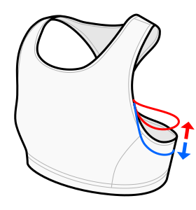

This option adjusts the height of the armhole.

By default, slight negative ease is added, so it sits relatively snug in the armpit.
But of course, the fabric might not stretch evenly and might not sit exactly like the pattern code calculates.

In my prototypes, the default value fits quite well without digging in, but you may find that you need to adjust this,
especially if your waist-to-armpit measurement is slightly incorrect.

