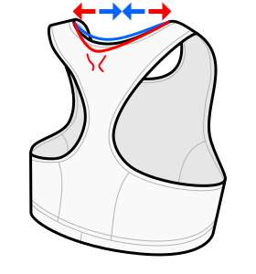

Sabrina creates a virtual dart to prevent sticking up fabric in the center of the back neck.

This option essentially determines how much the straps are being rotated inwards,
towards the neck, which stretches the fabric on the back of the neck when worn.

