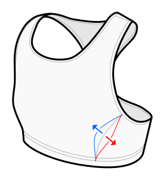

This option determines how much the front side seam aims at the bust point (your nipple).

A value of 100% puts the seam close to the bust point,
which results in an optimal bust shape and more even stretching, but can be uncomfortable.

Negative values shift the seam away from your bust point.

Leave this at the default value if unsure.

