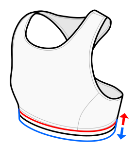

Set this to the width of the elastic band you'll use for your under-bust band (or waistband).

The default value is set to about 20 mm, which is a common value for store-bought elastics.
Change according to what you've bought or what you want to use.

I don't recommend going below 10 mm, as this will either not give enough support or dig in uncomfortably.

