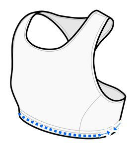

This option determines the ease of the fabric at the height of the under bust band (or waistband).

You can (and probably should) add additional stretch to the elastic band hidden inside the fabric.
This is not relevant for this option.

