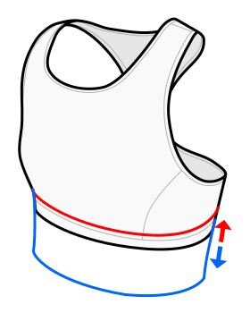

This option determines the length of the top.

At 0% the band will sit directly below the bust and start at the under bust measurement.

At 100% the waistband will start below the waistline.

Since the fabric can stretch in various ways, this might not be super accurate.
The length of the bra will also depend on the vertical stretch and strap stretch options.

