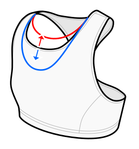

This option allows you to customize the depth of the front neckline.

By default, Sabrina has a relatively high coverage at the front.
You can lower the neckline for a more open design.

However, keep in mind that significantly lowering the neckline may impact the fit,
as it reduces the amount of fabric encircling and compressing your body.

