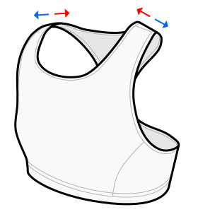

This option determines the position of the shoulder straps alongside your shoulders.

Low values move the straps near your head, large values move the straps towards your shoulders.

Leave this at the default value if unsure.

