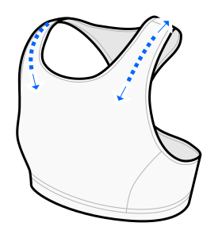

This option determines how much the shoulder straps will stretch when worn.

Going too low will result in too long straps.

Going too high will result in too short straps.

Leave this at the default value if unsure.

