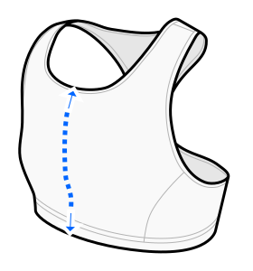

This option determines how much the fabric will vertically stretch over your bust when worn.

Going too low will result in a loose fit or a garment that is too long.

Going too high will result in an uncomfortably tight fit or the bra being too short (in extreme cases).

