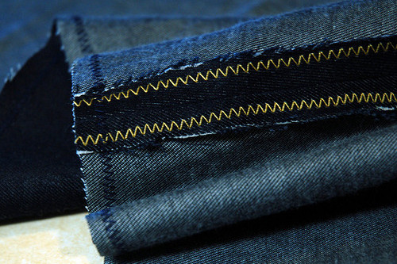

A zig-zag stitch is useful for when you need to sew a stretchable seam (like when using knits).
You can also use it for a decorative effect, or to lock the edge of your fabric.

As most, if not all, sewing machines can sew a zig-zag stitch,
it's a popular alternative for when more specialised stitches are not available.

> Everyone's favourite encyclopedia has more on the zig-zag stitch:
> [Zigzag stitch on Wikipedia](http://en.wikipedia.org/wiki/Zigzag_stitch)

> Picture by [Kristin Roach](https://www.flickr.com/photos/kristinroach/3161126359)
