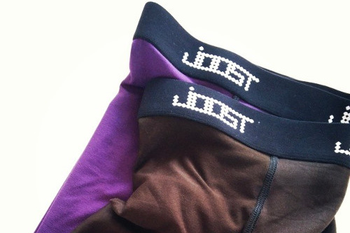

Rayon, sometimes referred to as viscose, is a synthetic fiber.
It originates from wood pulp, but there's a lot of chemical hoops to jump through before it becomes fabric.

As rayon is a fiber (like cotton is) the resulting fabric will depend on how it is woven.
However, in general rayon is a versatile fabric that is smooth to the touch, drapes, and is somewhat slippery.

Rayon is not a good insulator of body heat.
That makes it a poor choice for a winter coat, but a good choice for your summer dresses or underwear.

> Wikipedia has a lot to say about rayon: [Rayon on Wikipedia](http://en.wikipedia.org/wiki/Rayon)
