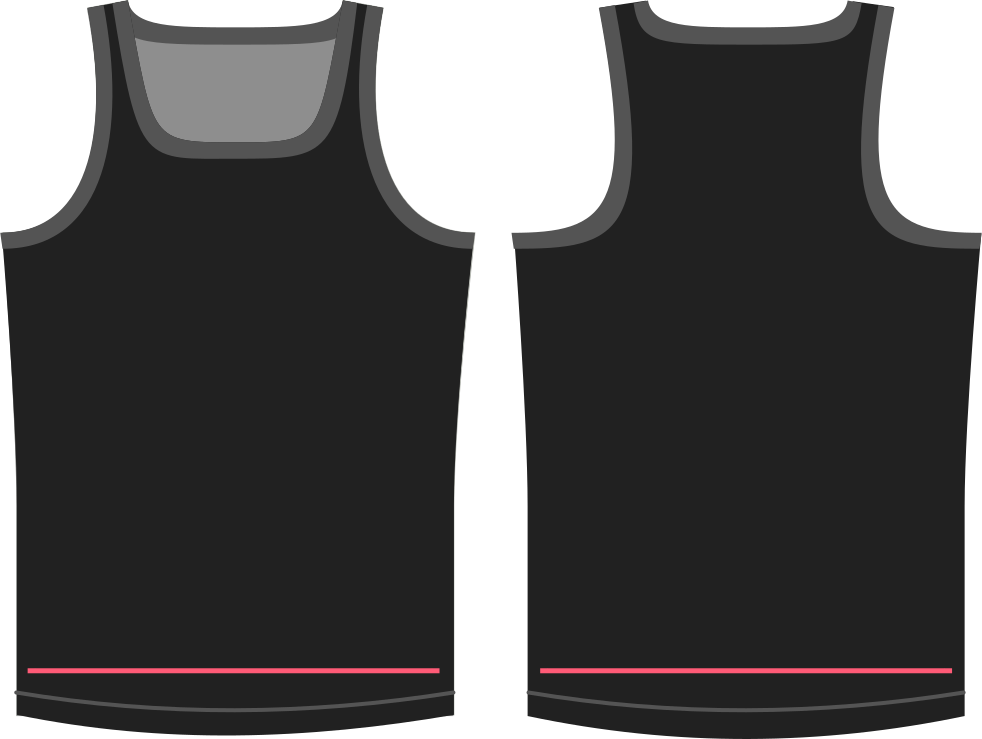

How much room do you want at the hips?

Whatever value you provide here will simply be added to your hips circumference measurement when drafting the garment.

> ##### This option also allows negative values.
>
> You should only use negative ease if you are using a stretch material that you want to fit tightly.
> Overall stretch should be configured with the stretch option.

