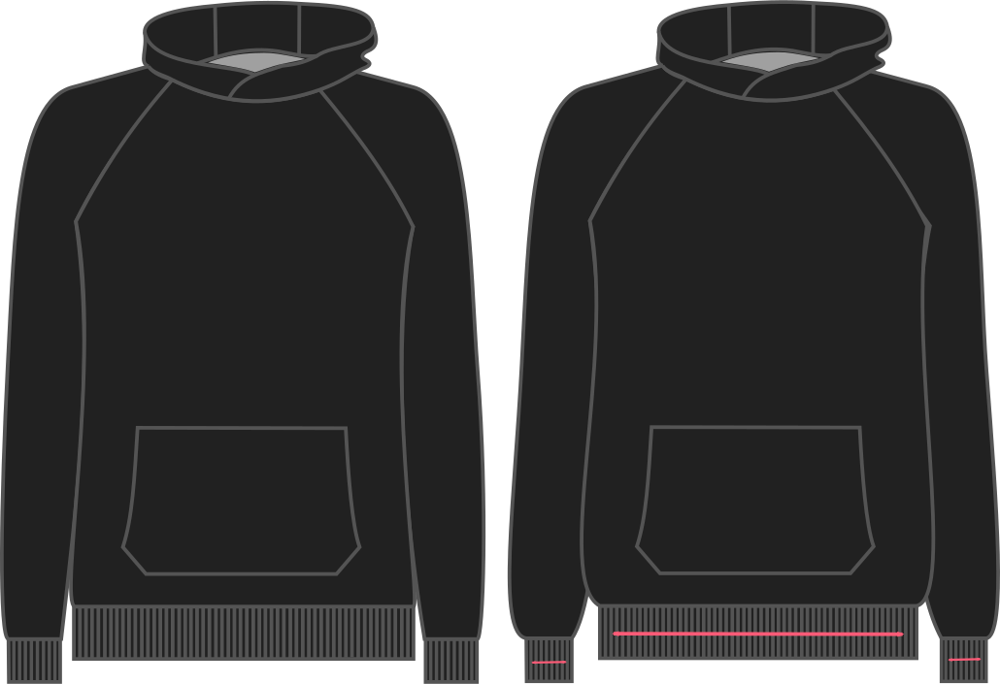

This option allows you to tweak the stretch of your ribbing.

It's value is the percentage of stretch in the ribbing fabric, and
that amount will be subtracted from 100% to determine the final width
of fabric used in the pattern.

For example, if you choose 10%, then for every 10 cm of ribbing,
we'll only draft 9 cm.
This way, 9 cm of ribbing will be stretched to 10 cm.

The option range is between 0% and 10%, with the default set to 5%.

<Note>

If you're not sure what to pick, best is to take the ribbing you are going to use see how much of it
you need to stretch out to get to 10 cm with a _good_ stretch.

</Note>

