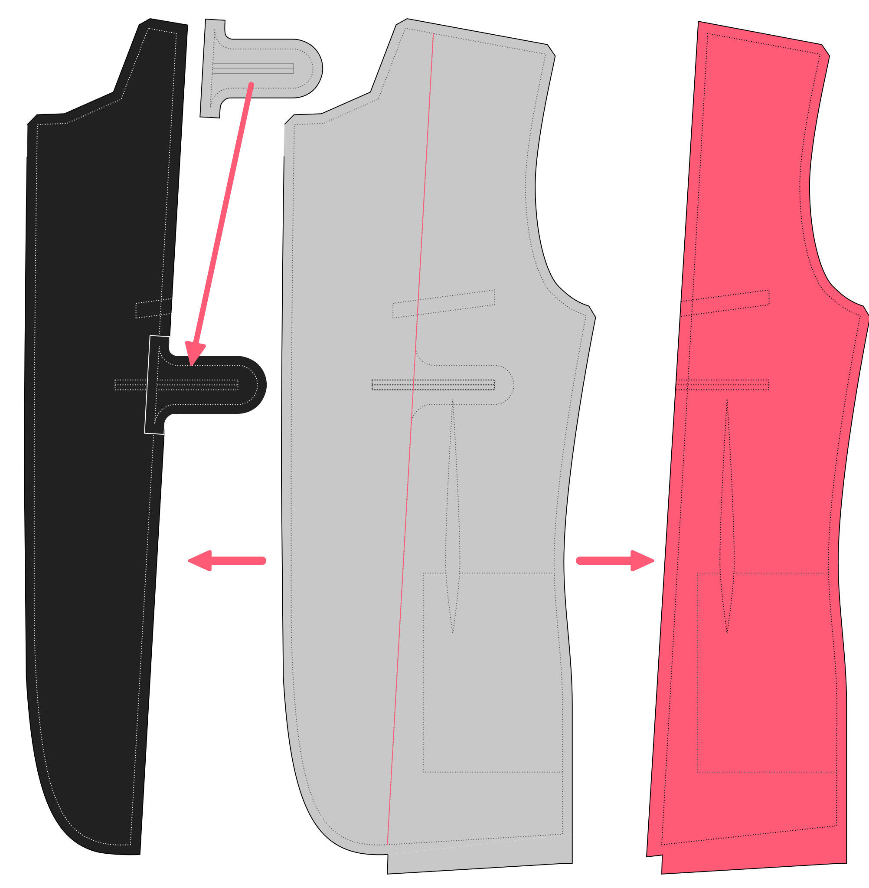

<DesignInfo design="jaeger" />

<!--------------------------------------------------->

## Designer Notes {#notes}

I guess that when you start designing sewing patterns as a man, sooner or later
you are going to want to design a jacket.

However, that's not why I did it. I got involved in this because I promised
[Portia Lawrie](https://www.instagram.com/portialawrie/) that I would help her
out with her Refashioners initiative and long story short, [I ended up making a
zebra jacket](/blog/the-refashioners-2017/) for which I obviously needed a
pattern.

So here it is.

joost

<!--------------------------------------------------->

## What You Need {#needs}

To make Jaeger, you will need the following:

- About 2.5 meters (2.8 yards) of a suitable fabric (see [Fabric options](#fabric-options))
- Lining fabric, optionally different sleeve lining fabric
- Two larger buttons for the front, and 8 buttons for the sleeves
- A bit of lightweight fusible interfacing for local enforcement
- Canvas for the fronts and collar
- Tailor's tape for the front edges
- Some domette for interlining
- Shoulder pads
- Sleevehead wadding, with canvas if possible
- Undercollar fabric

:::note

###### Where to get all this stuff

Making Jaeger is a fun and rewarding project, but getting all the required bits
and pieces can be challenging.

That is because this kind of project is somewhat more ambitious than the
typical home sewing project, and as a result, your local haberdashery is
unlikely to stock all of these things.

If you know where to get them, great. If not, some (quality) suppliers
sometimes sell a **Jacket trim pack** that includes everything you need.

Below is a list of suppliers we are aware of where you can get this.
We have no affiliation with these suppliers.

- [B. Black & Sons](https://www.bblackandsons.com/) is based in the US
- [Kenton Trimmings](http://kentontrimmings.co.uk/shop/) in based in the UK

If you know of other places that carries this stuff, please let us know.

:::

<!--------------------------------------------------->

## Fabric Options {#fabric}

Sportscoats are typically made from a heavier wool, often with some texture or pattern in the weave.
In general, they are made in _busier_ fabrics.

Style purists will argue that sportscoats should never be made out of suiting fabric, as a sportscoat
is not a suit jacket. You can tell them go feck off and do whatever you want, it's your jacket.

However, making Jaeger is going to take some time. Do yourself a favour and get something nice for the final project.
(because you will be making a muslin, right?)

<!--------------------------------------------------->

## Cutting Instructions {#cutting}

- **Main fabric**
  - Cut **2 fronts** (part 1)
  - Cut **2 front facings** (look for the facing/lining boundary on the front part)
  - Cut **2 backs** (part 2)
  - Cut **2 sides** (part 3)
  - Cut **2 topsleeves** (part 4)
  - Cut **2 undersleeves** (part 5)
  - Cut **1 collar** (part 7)
  - Cut **1 collarstand** (part 8)
  - Cut **2 pockets** (part 9)
  - Cut **1 chest pocket welt** (part 10)
- **lining fabric**
  - Cut **2 fronts** (part 1)
  - Cut **2 front linings** (look for the facing/lining boundary on the front part, and don't forget to attach the inner pocket facing extension)
  - Cut **2 backs** (part 2)
  - Cut **2 sides** (part 3)
  - Cut **2 topsleeves** (part 4) Note: Some people like to use different lining for the sleeves
  - Cut **2 undersleeves** (part 5) Note: Some people like to use different lining for the sleeves
  - Cut **2 chest pocket bags** (part 11)
  - Cut **2 inner pocket welts**
  - Cut **2 inner pocket bags** (part 13)
- **Canvas**
  - Cut **2 fronts** on bias (part 1) Note: Don't include seam allowance
  - Cut **2 chest pieces** on bias. Look for the indication on the front part. Note: Don't include seam allowance
  - Cut **1 undercollar** (part 6). Do not include seam allowance.
- **Undercollar fabric**
  - Cut **1 undercollar** (part 6)

:::note

###### Good sides together, or precise pattern matching?

When cutting out two, you can cut them [good sides together](/docs/sewing/good-sides-together).
However, when working with fabric with a pattern, I prefer to cut them individually to finely control the pattern matching.

When you cut them individually, remember that they need to be mirror images of each other. So flip either your pattern or your fabric over when cutting the second one.

:::

:::warning

###### Cutting caveats

- The chest piece is marked on the front.
- Don't include seam allowance when cutting out canvas, and cut it on bias.
- The front facing and lining is marked on the front piece. They split the front part in two along the boundary line. You can cut the front part along that line after cutting out the front from the main fabric. The inner pocket extension for the facing is printed separately, and you can tape it back in its place after cutting the pattern piece. **Do not forget to add seam allowance to both the facing and the lining for this boundary seam**.

:::

:::info comment

Instead of cutting the canvas parts _nett_ (without seam allowance),
there is an alternate
method where seam allowance is included on the canvas parts.
The idea is that because the canvas parts have seam allowance,
when they are attached to the main fabric pieces this can allow
ease to be worked into the garment for a better shape.
The seam allowance is then trimmed from the canvas at a later point
in the garment construction process.

However, because this is a more advanced tailoring technique,
our instructions are instead written with the nett canvas method.

Benjamin F.

:::
