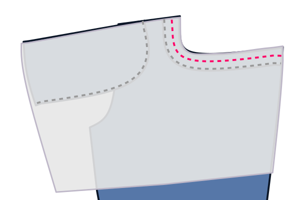

## Preface

:::tip
The original instructions were originally put together by a German software developer.

Maybe you can add some sewing tips,
improve the language, describe steps more clearly, whatever.

If you like to help, click on the "Edit this page" link at the end of the page to submit your changes.

Jonathan
:::

The pictures will use the following color scheme:

- **Good side of main fabric**: Blue
- **Bad side of main fabric**: Medium gray
- **Lining fabric**: Light gray
- **Raw edges**: Black border
- **Fold lines**: Light blue border
- **Serged/finished edges and bartacks**: Zigzag line
- **Straight stitches**: Dashed line

Stitches done in the current step have a bright red/magenta color. Old stitches from previous steps will be muted.

## Step 0: Review the construction

Paul has some design options that affect the look of the pants and which parts you need.

You can disable the front and back pockets, but this mostly makes only sense if you want to create a simple mockup for
fit-checking or if you want to design your own pockets.

More importantly, you can disable the pocket facing and pocket entry facing.
This can be useful if you're making the pockets out of the same material as the outer layer of your pants
(so the facing would be unnecessary).
Or if you're going for a specific look where the pocket bag should be visible from the outside.

You can also change the fly setting to expose the buttons in the fly or switch the fly to a zipper.
Please refer to the Charlie instructions for how to sew a zipper fly.

The last main option is if you want a crotch gusset.

A crotch gusset provides added comfort, durability,
and flexibility by reducing stress at the seams and allowing for greater freedom of movement.

It can also slightly reduce fabric usage, as the front and back pieces are narrower with the gusset enabled.

The main minor drawbacks are the need for an additional seam and a potential impact on the garment's appearance.

I recommend leaving the gusset enabled, since it also makes sewing easier by reducing the number of layers that
you need to join at the fork.

## Step 1: Finish curved edges

The pattern contains a few curved edges that won't be joined in a seam,
so you'll need to serge or zigzag them, even if you're using a serger.

These edges are marked on the pattern pieces with a zig-zagged blue line.

So this is what you need to do:

- Press part 10 _bad sides together_ and join and finish the J-seam using a serger (without knife) or zigzag stitch.

- Also finish the J-seam on part 6 and the curved outer seams on parts 12 and 13 the same way

Skip any parts that you have disabled in the design options.

:::note
If you don't want to serge the other seams,
you might also want to finish all the remaining raw edges now, so you don't have to do that later.
:::

## Step 2: Prepare the fly extension

Fold and press part 7 good sides together and join the bottom seam. You can use a serger or a straight or zigzag stitch.

Then trim the bottom seam allowance (if necessary) and reverse it so the good side is outside. Press again.

## Step 3: Face the front pockets

:::note
I assume you want the good side of the pocket bag on the inside of the pockets.
You can also do it the other way round.
:::

Place the pocket bag so that the good side (the side you want on the inside) is facing up.

Align part 13 good-side-up onto the cut-out corner of the pocket bag and part 12 also good-side-up onto the complete corner.

The parts are mirrored so make sure you choose the correct one.

Stitch close to the edge of the outer curve (that you already finished).

Repeat this mirrored for the other pocket bag.

:::tip
This pattern doesn't contain a coin pocket.

However, if you want to add one, now is a good time.
Just prepare it like the back pockets in step 11 and topstitch it onto one of the front facings.
:::

## Step 4: Attach the front pockets

Pin the pocket bag onto the matching front part aligning the cutouts,
_good sides together_ and sew along the curved seam.

Trim or snip the seam allowance for easier turning, then fold it over so the good sides are outside and press.
If your fabric is very heavy, you can use a hammer to flatten the fabric.

Edgestitch along the edge to secure it,
making sure the edge looks clean and the inside isn't visible from the outside.

We'll be doing a French seam for the front pocket bag.

Fold the pocket bag onto itself bad sides together (and facings on the outside)
and sew along the bottom using standard seam allowance.
Keep the large front part out of the way.

Trim the seam allowance to half its width.

Turn the pocket bag inside out so the facings and seam allowance are on the inside.
Iron this edge flat.

Then sew along the bottom again using standard seam allowance to enclose the seam allowance between both stitches.

You don't need to attach the side of the pocket to the outseam for now, we will do that later.

Do this for both sides.

## Step 5: Join the front parts

Join both front parts between the fly bottom and the fork, good sides together, with a straight stitch.

Ensure that this seam is solid, as you don't want it to rip.
Do it twice if in doubt.

## Step 6: Attach the fly facing

:::note
These instructions are for a button fly.
If you want to do a zipper fly, which is a little more complicated,
construct the fly using the [charlie instructions](/docs/designs/charlie/instructions/#attach-the-fly-facing)
:::

Pin the fly facing (part 6) _good sides together_ on the left front piece (the one without the extended seamline).

Keep the seam allowance of the right leg out of the way and join both parts along the cross-seam line.

Fold the fly facing open, press the seam allowance towards the facing.

Edge stitch a millimeter away from the seam to secure the seam allowance.

Flip the fly facing towards the inside of the pants and press.

Edge stitch close to the fold to secure it. Leave the curved side unattached for now.

## Step 7: Create the buttonholes and do the J seam

### If you want to have hidden fly buttons (this is the default):

Insert buttonholes into the fly placket as shown on the pattern.
Adjust the size and position as needed for your buttons.

Pin the fly placket on top of the fly facing on the inside of the pants.

The fly placket is a little bit less wide than the fly facing,
to give it a slight offset that makes it invisible from the outside.

So make sure to align it along the J seam
and make sure it is a little bit behind the front part along the cross-seam.

Handbaste the J seam from the inside to transfer its location to the outside
and topstitch along it from the outside, being careful to catch all four layers.

### If you want to have visible fly buttons:

In this case, we don't need a fly placket and will construct the buttonholes directly into the front and facing.

Unfold the fly facing temporarily and trim the seam allowances to a few millimeters,
so that the inside seam allowance doesn't get in the way of the buttonholes.
This will ensure that the fabric along the buttonholes has the same thickness everywhere.

With the fly facing folded again to the inside,
handbaste the J seam to transfer its location to the outside
and topstitch along it, being careful to catch both layers.

Mark and create buttonholes inside the J seam area.
Adjust the size and position as needed for your buttons.

## Step 8: Attach the fly extension

The other front part is for the right side of the pants and should have a small extension where the fly is.

This extension hides the seam we're creating now behind the fly facing when wearing the pants.

Place and pin the prepared fly extension good sides and raw edges together onto the extended area of the right front part.

Stitch using the standard seam allowance on both parts.
Make sure to not stitch accidentally along the center front line (ignoring the extended edge).

Fold the fly extension open, press the seam allowance towards the pocket.

Edge stitch a millimeter away from the seam to secure the seam allowance.
This stitch should still be right of the front center and thus be hidden when viewed from the outside later.

## Step 9: Finish the fly

Test-fit the fly, so the edge of the left leg matches with the center front line on the right leg.

Based on the buttonholes, determine where you want to attach the buttons on the fly extension and sew them on.

Topstitch the seam allowance below the fly to the side where the fly facing is.

Add some bartacks the secure the fly bottom.

## Step 10: Join the yokes

:::note
To join the different parts of the pants, you have various options.
Flat-felled seams are a professional option.
I prefer to serge the parts good sides together and topstitch twice to create a faux flat-felled seam.
The following steps will not contain specific instructions.
You do you.
:::

Join each yoke part with the corresponding back part.

Make sure you use the correct yoke part in the right orientation.

The arrow on the yoke pattern part points towards the upper center back of the pants,
where the yokes and the waistband meets.

## Step 11: Join the back parts

Join both back parts (including yokes) along the cross-seam.
Make sure to align the seams where the yokes are joined.

## Step 12: Prepare the back pocket

If you haven't already, cut out the back pocket part without seam allowance from robust heat-resistant cardboard.

Place the cardboard template onto the bad side of a back pocket part and press the seam allowances inward.
The top edge should form a hem and needs two folds.

Sew along the top hem to secure it.

## Step 13: Attach the back pocket

Align the back pockets symmetrically onto the back and topstitch along the sides and bottom, leaving the top open.

For symmetry, it's best to use the optical center, e. g. if you've done two rows of topstitching on the crossseam,
use these the topstitching lines as the center, instead of the seam.

## Step 14: Attach the gusset

Skip this step if not using a gusset.

Pin and sew the gusset to the front parts.
The left side on the pattern (usually the straighter side) joins with the front parts.
The right side will be attached to the back parts later.

Press and pin the seam allowance towards the gusset and topstitch.

Treat the gusset as part of the front for the following step.

## Step 15: Join front and back parts along the inseam

Sew the front and back together along the inseam.
Join the inseam starting from the bottom of one leg towards the crotch towards the bottom of the other leg.
Make sure the cross-seam of the front is properly aligned with the cross-seam on the back.

:::note
Alternatively, you can do two seams starting from the crotch region towards each leg.
This can make it easier to keep the center seam aligned.
:::

Press and topstitch this seam towards the back.

## Step 16: Do the outseams

With _good sides together_, finish and join both outseams. Include pocket bag and pocket facings in the seam. Make sure
the outer layer of the pocket is not too tight, compared to the inner layer with the pocket facing,
so you can later still comfortably fit your hand into the pocket.
This is especially important for thick, non-stretchy fabric, such as heavy pure-cotton denim.

Reinforce the outseam on the back part by edge-stitching from the waist down
until the pocket bag ends or about 15 cm (6 inches).
Go only as far as your sewing machine comfortably allows, since you will likely not be able to go inside the pant legs.

To make sure both sides are even, you can mark the end of the seam beforehand.

Secure the bottom of the seam with a bartack or by going backwards and forwards a few times.

## Step 17: Attach the belt loops

### Construct the belt loops

:::note
For efficiency, we will construct one long strip of belt loop that we'll divide
into multiple parts.
:::

Serge (or zigzag) the long edge of the strip on both sides.

Fold one side inwards, and the other side over it.
Then press down with your iron.
The result should be a long strip about 1.5 cm wide.

Secure the belt loops by edge stitching along both sides.

Finally, cut your belt loops strip into individual belt loops.

By default, you need five belt loops (one for the center back, two for the sides in the back, two for the front)

### Attach the belt loops

Place the belt loops where you want them with their good side down (against the good
side of the pants, and the top aligned with the raw edge at the top of the pants).

Sew this down in the seam allowance of the waist, making sure that they are perpendicular to the waistband.

## Step 18: Attach the waistband

### Assemble curved waistband

If you're making a straight waistband, skip directly to attaching the waistband
to the outside.

Place both waistbands with good sides together, and sew along the top of the
waistband (the shorter edge).

Trim the seam allowance of the inner waistband, and press all seam allowances
towards the inner waistband.

You can now treat your assembled waistband as one piece, and continue as for
the straight waistband.

:::tip
To make sure your inner waistband doesn't peek out, you can _understitch_. Sew
a line of stitching on the inside waistband, close to the edge, through the
inner waistband and seam-allowances (but not the outer waistband!).
:::

### Attach the waistband to the outside

Place the waistband with good sides together along the waist. For the straight
waistband, make sure the side with the standard seam allowance is aligned with
the waist, and not the side with double seam allowance.

Also make sure to leave sufficient seam allowance beyond the start and end of
the waistband.

Sew along the entirety of the waist, attaching the waist band and sewing down
the belt loops in one go.

### Press the waistband seam and fold the waistband

Press the seam you just sewed, pressing the seam allowance up into the
waistband.

Now fold over the waistband at the correct width and press in the crease.

### Close the start and end of the waistband.

At the start and end, fold the waistband over so it has its good sides
together.

Now sew the end shut by sewing top to bottom to just the point where the
waistband seam ends.

Trim back the seam allowance a bit so you can tuck it all into the waistband
later.

### Baste the waistband in place

The waistband has extra seam allowance here, and we're going to use that to our
advantage.

Fold the waistband in the fold you pressed. Then on the inside, fold the seam
allowance inwards, making sure to let it run a few mm beyond the waistband
seam.

You want to baste this in place so it stays put as you make your way around the
waistband.

At the start and end of the waistband, you'll need to tuck in some more seam
allowance. Take a moment to get it right.

### Sew the waistband close

Now with the good side up, sew exactly in the seam that was sewn before (so
called _stitch in the ditch_).

This will catch the back of the waistband which we've made to extend slightly
further, and lock all the seam allowance inside.

## Step 19: Finalize the belt loops

### Sew the belt loops down to make them wider

It's best to make the belt loops a bit wider than the waistband, to accommodate
wider belts.

For this, let the waistband lie flat, and sew it down with a bartack 1.5cm or
so (half an inch) below the waistband.

### Fold upwards, down again, and sew down

Now fold the belt loops upwards (hiding the bartack you just did).

They'll extend beyond the top of the waistband. So fold the excess down again.
Don't fold it over/around the waistband, but fold it double on itself.

Now do a bartack along the top of the waistband to lock the belt loop in place.

When you're done, carefully twist the back of the beltloop to the front and cut
off the excess right next to the bartack.

:::tip
Be careful not to bartack the front of your trousers to the back.

Double-check you don't have any extra layers under your needle because
unpicking a bartack is no joy.
:::

## Step 20: Hem the pants

Fold the hem allowance up, and press.
Then fold them again, and press again.

Topstitch the seam allowance.

## Step 11: Finishing steps

Create a buttonhole. Either by hand (it's worth practicing) or with a machine.

Attach the button to the waistband.

If you want to use rivets, reinforce the sides of the pocket openings and similar locations.
Alternatively, you can use bartacks for reinforcement.
